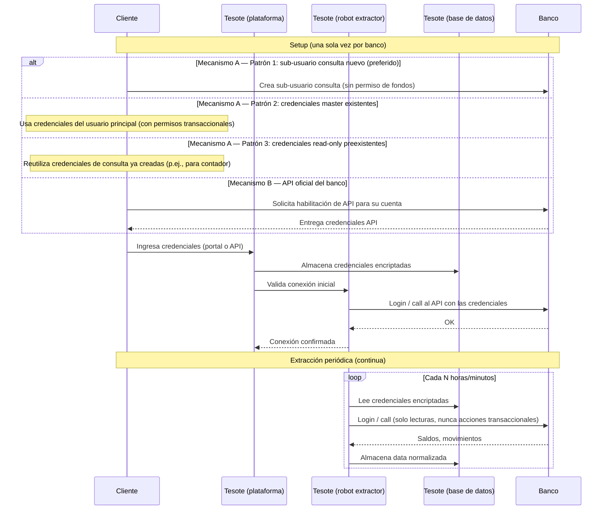
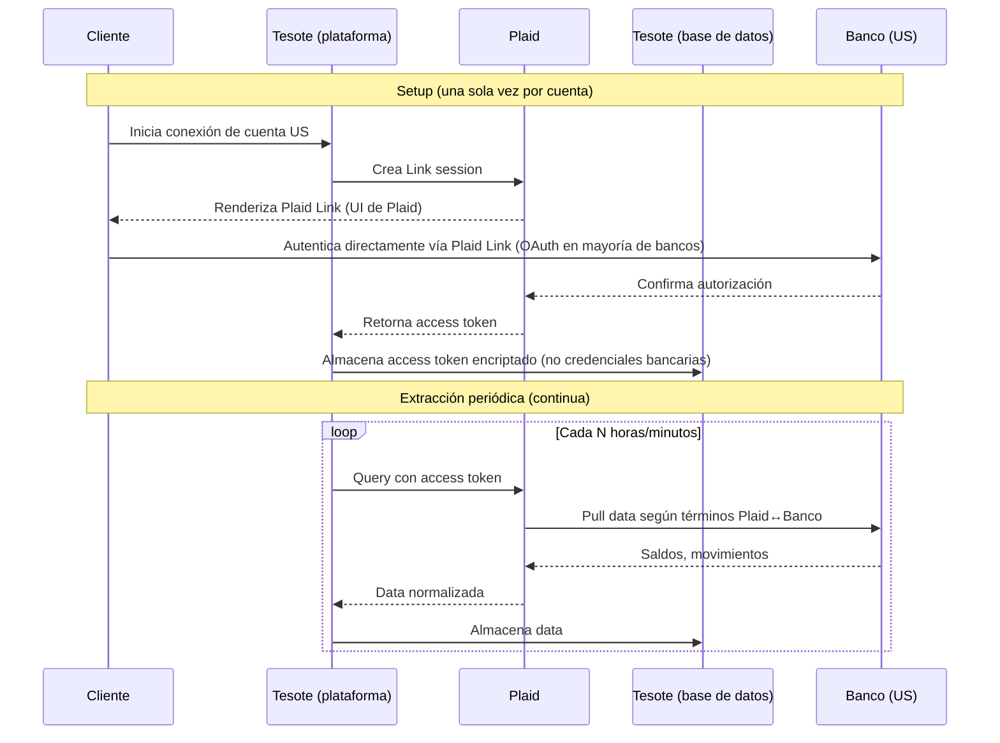

# Flujograma — Tesote Connect

**Producto**: Connect es el módulo de Tesote que permite a una empresa cliente conectar sus cuentas bancarias y extraer de forma programática y periódica su data financiera (saldos, movimientos, estados de cuenta), centralizándola en una base de datos propia de Tesote a la cual el cliente tiene acceso vía la plataforma web.

**Modelo comercial**: suscripción anual, facturación mensual, sin componente transaccional. *No hay movimiento de fondos en este producto.*

**Audiencia de este documento**: PTCK, Fase 1 (análisis regulatorio).
**Documento base**: [Tesote's Legal Affairs — April 2026](tesote-legal-affairs-april-2026.md), sección P0.2.
**Notas**: Algunos detalles técnicos específicos (esquemas de cifrado, ubicación de infraestructura, RTO/RPO, etc.) están en confirmación interna en Tesote y se completarán en una versión posterior de este documento.

---

## 1. Actores

| Actor | Rol |
|---|---|
| **Cliente** | Empresa B2B venezolana (con RIF, registro mercantil, contabilidad estructurada). Es quien firma el contrato con Tesote. |
| **Usuarios del cliente** | Personas físicas autorizadas por el cliente a usar la plataforma Tesote (CFO, contralor, contadores, tesorería). |
| **Tesote C-corp (Delaware)** | Entidad propietaria del software, contratante en algunos casos, custodio de la infraestructura tecnológica. |
| **Tesote VE** | Entidad venezolana, contratante en otros casos (decisión por cliente, no sistemática). Hoy sin relación societaria con la C-corp de Delaware. |
| **Banco** | Institución bancaria titular de la(s) cuenta(s) del cliente. Puede ser un **banco venezolano** (mayoría de los casos) o un **banco extranjero** — Panamá, República Dominicana, Estados Unidos u otras jurisdicciones del Caribe. La conexión se ofrece independientemente de la jurisdicción del banco. Tres mecanismos de integración coexisten (ver §2.2): (A) **scraping del portal web**, (B) **API oficial del banco**, (C) **Plaid (agregador de terceros)** — en bancos en EEUU. |
| **Plaid** | Agregador estadounidense de datos bancarios. Actúa como capa intermedia entre Tesote y los bancos en EEUU. Mantiene acuerdos directos con la mayoría de los bancos importantes de EEUU. Tesote es cliente de Plaid bajo el Plaid Developer Agreement; el cliente final autoriza directamente a Plaid (vía Plaid Link) sin compartir credenciales con Tesote. |

---

## 2. Flujo end-to-end

### 2.1 Onboarding comercial (offline)

1. Tesote y el cliente acuerdan los términos comerciales (precio anual, alcance de servicios contratados, número de cuentas, número de usuarios, etc.).
2. Las Partes firman el **Contrato de Prestación de Servicios (MSA)** — el contrato marco usado hoy es el adjunto a este expediente. Anexos:
   - **Anexo I** — alcance, funcionalidades, límites operativos, tarifas y condiciones de pago.
   - **Anexo II** — funcionalidades adicionales y tarifas de activación (hoy típicamente "sin contenido aplicable").
   - **Anexo III** — Módulo de cobros ("Tesote Cobros") (hoy típicamente "sin contenido aplicable"; reservado para el producto Payments cuando se active).
   - El MSA **incorpora por referencia los Términos y Condiciones publicados en la plataforma Tesote Web** (cláusula 14 del MSA). Esos T&C son un documento separado (no anexo al MSA) — se enviarán a PTCK aparte.
3. Cliente recibe factura mensual. Según el cliente, la factura es emitida por la **Tesote C-corp (Delaware)** (USD, sin pasar por fisco venezolano) o por **Tesote VE** (en bolívares, con factura formal). *Decisión cliente-por-cliente, sin patrón sistemático hoy.* **No existe variante alternativa del MSA**: todos los clientes — incluso aquellos a quienes se les factura desde la C-corp Delaware — firman bajo el mismo MSA template, donde la entidad contratante por Tesote es la VE (TST SERVICIOS Y CONSULTORIA, C.A.). Punto relevante para el análisis estructural en P2.1 del documento maestro.

### 2.2 Setup técnico — banco por banco

**Tres mecanismos de integración coexisten** según disponibilidad por banco / jurisdicción y elección del cliente:

- **Mecanismo A** — Scraping del portal con credenciales custodiadas por Tesote.
- **Mecanismo B** — API oficial del banco.
- **Mecanismo C** — Plaid (agregador de terceros) para bancos en EEUU.

Cada mecanismo tiene un perfil legal y regulatorio distinto. La lógica posterior al setup (extracción periódica, almacenamiento en DB Tesote, acceso del cliente vía dashboard) es la misma en los tres casos.

#### 2.2.1 Mecanismo A — Scraping del portal con credenciales custodiadas

Cliente entrega credenciales del portal web del banco a Tesote; Tesote las encripta y almacena; los robots de Tesote inician sesión en el portal y descargan la data. **Tres patrones de credenciales coexisten dentro de este mecanismo**:

1. **Sub-usuario consulta creado al onboarding (patrón preferido).** Tesote instruye al cliente a crear, dentro del portal del banco, un sub-usuario con permisos de solo consulta — sin atribuciones de movimiento de fondos. El sub-usuario solo puede ver saldos, movimientos, estados de cuenta. Es creado por el cliente directamente en el portal del banco; Tesote nunca interviene en esa creación. **Es el patrón que Tesote promueve activamente** porque limita la superficie de riesgo en caso de incidente con las credenciales.
2. **Credenciales del usuario master / principal.** En algunos casos el cliente entrega a Tesote las credenciales del usuario principal — credenciales que **sí tienen atribuciones de movimiento de fondos**. Tesote operativamente solo realiza acciones de consulta, pero técnicamente las credenciales tienen capacidad transaccional plena.
3. **Credenciales read-only preexistentes.** En otros casos el cliente reutiliza credenciales de solo consulta que ya tenía creadas antes de contratar a Tesote (por ejemplo, un usuario de consulta creado para su contador o para una herramienta previa). En esos casos no hay creación de sub-usuario nuevo; Tesote recibe credenciales ya existentes.

**Implicación regulatoria** (auto-análisis preliminar): los patrones 1 y 3 limitan la capacidad técnica de Tesote a "lectura". El patrón 2 le da a Tesote acceso técnico a acciones transaccionales que **operativamente nunca ejerce, pero técnicamente podría ejercer**. Este matiz es importante para el análisis de PTCK — la defensa "Tesote nunca toca los fondos" sigue siendo cierta operativamente, pero la defensa "Tesote no puede tocar los fondos" no es uniformemente sostenible.

Tesote no cuenta hoy con desagregación interna sistemática del porcentaje de clientes o cuentas por patrón. Los tres patrones coexisten en la práctica.

#### 2.2.2 Mecanismo B — API oficial del banco

Cuando el banco ofrece API oficial (hoy en VE aplica únicamente a **BNC**; algunos bancos extranjeros también la ofrecen), en lugar del patrón de scraping con credenciales de portal, el cliente solicita al banco la habilitación de las APIs para su cuenta. El banco entrega credenciales API al cliente, quien las comparte con Tesote (declarando a Tesote como "partner tecnológico" cuando el banco lo requiere). Tesote encripta y almacena dichas credenciales. La consulta se hace contra los endpoints oficiales del banco.

Para Connect, Tesote utiliza únicamente endpoints de **lectura** (saldos, movimientos, estados de cuenta). Las atribuciones transaccionales del API de BNC, aunque disponibles bajo las mismas credenciales, son relevantes únicamente para Payments y se tratan en flujograma separado.

**Hoy Mecanismo B aplica únicamente a BNC.** Ningún otro banco — venezolano o extranjero — se conecta vía API oficial: los bancos venezolanos no-BNC y los bancos extranjeros no-EEUU se conectan vía Mecanismo A (scraping); los bancos en EEUU se conectan vía Mecanismo C (Plaid).

#### 2.2.3 Mecanismo C — Plaid (agregador de terceros) para bancos en EEUU

Para cuentas de clientes en bancos de Estados Unidos, Tesote usa **Plaid** como capa intermedia. Plaid es un agregador estadounidense de datos bancarios con acuerdos firmados con la mayoría de los bancos importantes de EEUU. El flujo es distinto en aspectos relevantes:

1. **Autenticación directa cliente↔banco vía Plaid Link.** Cuando el cliente conecta una cuenta US, la plataforma Tesote le presenta el flujo de Plaid Link. El cliente se autentica directamente con su banco a través de la interfaz de Plaid, ingresando sus credenciales en la UI de Plaid (no en la UI de Tesote). En la mayoría de los bancos importantes de EEUU, este flujo es OAuth — el cliente es redirigido al portal de su propio banco y autoriza el acceso ahí.
2. **Tesote no recibe ni almacena las credenciales del banco.** Plaid retorna a Tesote un **access token** por la cuenta autorizada. Tesote encripta y almacena el token, no las credenciales bancarias.
3. **Las consultas periódicas se hacen contra la API de Plaid**, no contra el banco directamente. Plaid relays con el banco según los términos negociados entre Plaid y cada banco.
4. **Tesote es cliente de Plaid bajo el Plaid Developer Agreement**. Esto implica obligaciones contractuales hacia Plaid (uso permitido de la data, retención, security standards, etc.) que se suman a las obligaciones de Tesote frente al cliente.

**Implicación regulatoria** (auto-análisis preliminar): este mecanismo es estructuralmente más limpio que el A en varios ejes:
- Tesote **no custodia credenciales bancarias** del cliente → reduce dramáticamente la superficie de riesgo de credential leakage.
- Plaid es la entidad regulada que mantiene la relación con cada banco (Plaid está sujeto a regulación financiera de EEUU — GLBA, FTC Act, leyes estatales tipo CCPA, etc.) → corrimiento de obligaciones regulatorias hacia Plaid en la jurisdicción US.
- A cambio, **se introduce un tercero en la cadena de procesamiento de datos** (Plaid es un sub-procesador de facto). Esto añade un eje adicional al análisis de territorialidad y al DPA del cliente.

Datos confirmados sobre el uso de Plaid en Tesote:

- **Cobertura**: las cuentas de clientes en bancos de EEUU se conectan exclusivamente vía Plaid; no se usa scraping ni API de banco directamente para esta plaza.
- **Entidad firmante del Plaid Developer Agreement**: **TESOTE TECHNOLOGIES INC. (C-corp Delaware)** — la entidad propietaria de la operación tecnológica, consistente con la estructura corporativa esperada (no requiere rectificación).
- **Otras jurisdicciones**: Tesote **no** utiliza Plaid para jurisdicciones no-US. Aunque Plaid soporta UK / EU / Canadá, Tesote no lo aprovecha hoy.

#### 2.2.4 Captura, encriptación y validación (común a los tres mecanismos)

Independientemente del mecanismo:

1. **Captura en Tesote**. El cliente ingresa credenciales (mecanismos A y B) o autentica vía Plaid Link (mecanismo C) desde la UI de la plataforma Tesote.
2. **Encriptación y almacenamiento**. Tesote encripta y almacena lo que corresponda — credenciales para A y B, access token de Plaid para C — en su base de datos. La encriptación aplica tanto en tránsito (TLS) como en reposo. El esquema específico de cifrado (algoritmo, modo, gestión de llaves, rotación) y la ubicación física de la infraestructura (proveedor cloud, región) están en confirmación interna en Tesote.
3. **Validación inicial**. Tesote ejecuta una primera conexión de prueba para confirmar acceso válido; si falla, se notifica al cliente.

### 2.3 Extracción periódica

1. Procesos automatizados (en adelante, "robots" o "jobs") corren en la infraestructura de Tesote bajo dos modos: **(a) on-demand** (24/7, disparados por interacción del cliente o eventos del sistema) o **(b) scheduled** (el cliente configura su propia cadencia de extracción para cada cuenta).
2. Cada job, según el mecanismo:
   - **Mecanismo A (scraping)**: desencripta las credenciales, inicia sesión en el portal del banco autenticándose como el usuario correspondiente al patrón (1, 2 o 3 de §2.2.1), descarga la data y cierra sesión.
   - **Mecanismo B (API banco)**: desencripta las credenciales API e invoca los endpoints oficiales del banco.
   - **Mecanismo C (Plaid)**: desencripta el access token de Plaid e invoca los endpoints de Plaid; Plaid relays con el banco.
3. En todos los casos se descargan saldos, movimientos del período, y eventuales documentos descargables (estados de cuenta, comprobantes).
4. La data descargada se normaliza al modelo de datos de Tesote y se inserta en la base de datos propia de Tesote (proveedor cloud y región específica en confirmación interna).
5. Si la conexión falla (cambio de portal, bloqueo del banco, credenciales/token expirados, OTP requerido), el job levanta una alerta interna y notifica al cliente para refrescar.

### 2.4 Acceso del cliente a su data

1. El cliente y sus usuarios autorizados acceden a la plataforma Tesote vía web (login con email/password + factor adicional).
2. La plataforma muestra:
   - Saldos consolidados por banco y por cuenta.
   - Movimientos históricos.
   - Reportes (flujo de caja, conciliación, etc.).
   - Exportes (Excel, CSV) — la data se descarga del DB de Tesote, no del banco directamente.
3. **Controles internos de acceso a la data del cliente**: aplican varios controles operativos:
   - Los developers no tienen llaves de producción a las DBs principales (separación dev/prod).
   - El equipo de soporte tiene acceso únicamente a la data estrictamente necesaria para su función (principio de menor privilegio).
   - 2FA obligatorio para todos los accesos a sistemas internos.
   - El logging auditable específico de accesos administrativos a data del cliente está cubierto en §6.2 (detalle en confirmación interna).

### 2.5 Revocación / offboarding

1. El cliente puede en cualquier momento, desde la plataforma Tesote:
   - **Mecanismos A y B**: eliminar credenciales → Tesote borra las credenciales encriptadas y suspende los jobs para esa cuenta.
   - **Mecanismo C (Plaid)**: revocar la conexión → Tesote invoca el endpoint correspondiente de Plaid para invalidar el access token, lo borra de su DB y suspende los jobs.
2. El cliente puede también revocar directamente desde fuera de Tesote:
   - **Mecanismos A y B**: eliminar el sub-usuario consulta o las credenciales API desde el portal/back-office del banco → cualquier intento posterior de Tesote de conectarse falla silenciosamente.
   - **Mecanismo C (Plaid)**: revocar el consentimiento desde el dashboard de Plaid del cliente o desde el portal del banco (cuando el banco ofrece esa opción) → Plaid notifica a Tesote vía webhook y los jobs dejan de funcionar.
3. Cancelación del contrato → al cierre del ciclo, Tesote **borra la data del cliente**.

---

## 3. Diagramas (secuencias técnicas por mecanismo)

### 3.1 Mecanismos A y B — credenciales custodiadas por Tesote

### 3.2 Mecanismo C — Plaid (bancos en EEUU)

*(El consumo de data por parte del cliente — login a Tesote, dashboards, exportes — es común a los tres mecanismos y está descrito en §2.4. Para mantener legibilidad de los diagramas, no se repite aquí.)*

---

## 4. Inventario de datos

| Dato | Origen | ¿Encriptado? | Retención |
|---|---|---|---|
| Credenciales bancarias (sub-usuario consulta nuevo, master, read-only preexistente, o API según banco) | Cliente las ingresa | Sí | Mientras dure el contrato; borradas al revocar |
| Saldos por cuenta | Banco (vía robot, API oficial, o Plaid según mecanismo) | Sí (en tránsito + reposo) | Histórico completo durante el contrato; borrado al terminar |
| Movimientos / transacciones | Banco (vía robot, API oficial, o Plaid según mecanismo) | Sí | Histórico completo durante el contrato; borrado al terminar |
| Estados de cuenta (PDF) | Banco (cuando descargables) | Sí | Conservados durante el contrato; borrados al terminar |
| Plaid access tokens (mecanismo C) | Retornados por Plaid post-autenticación del cliente | Sí, encriptados | Mientras dure la conexión; revocados al desconectar la cuenta |
| Datos del cliente (RIF, razón social, contactos) | Cliente al onboarding | Sí | Mientras dure el contrato; borrados al terminar (sujeto a obligaciones de retención fiscal aplicables) |
| Logs de acceso a la plataforma | Sistema | N/A | Conservados; período específico en confirmación interna |

---

## 5. Base contractual

Mapeo de las cláusulas del MSA actual (versión "TST SERVICIOS Y CONSULTORIA, C.A.") a los pasos del flujo descrito arriba. Citas a número de cláusula del contrato adjunto.

- **Cláusula 1 — Alcance de los Servicios.** Define los Servicios como acceso a la plataforma SaaS Tesote Web "para la visualización, consolidación de saldos y transacciones bancarias de las cuentas vinculadas por el Cliente". **Posicionamiento regulatorio explícito**: "TESOTE actúa exclusivamente como proveedor tecnológico. No es una entidad financiera ni gestiona, ni ejecuta ni intermedia transacciones bancarias o movimientos de fondos en nombre del Cliente." → Esta es la línea de defensa principal frente a la regulación fintech para Connect.
- **Cláusula 5 — Obligaciones de TESOTE.** Incluye "Implementar medidas técnicas y organizativas razonables para proteger la información y los Datos del Cliente."
- **Cláusula 6 — Obligaciones del Cliente.** Incluye mantener confidencialidad de credenciales de acceso a la plataforma, uso lícito de los Servicios, etc.
- **Cláusula 7 — Confidencialidad.** Obligación recíproca de confidencialidad sobre información no pública. **Sobrevive cinco (5) años post-terminación.** No menciona específicamente la data bancaria del cliente como categoría especial; aplica el régimen general de "Información Confidencial".
- **Cláusula 8 — Propiedad de Datos.** "El Cliente conservará en todo momento la propiedad y todos los derechos sobre los datos que proporcione o genere en el marco de la utilización de los servicios. TESOTE únicamente accederá o compartirá los datos del Cliente cuando sea estrictamente necesario para la prestación de los servicios... o en cumplimiento de una obligación legal o requerimiento de autoridad competente. TESOTE no utilizará los datos del Cliente para ningún otro propósito sin el consentimiento previo y por escrito del Cliente." → Esta es la cláusula que informalmente referenciamos como "no comercialización", aunque el MSA **no usa el término "comercialización" ni la palabra "vender"** explícitamente. Punto a discutir con PTCK.
- **Cláusula 9 — Limitación de Responsabilidad.** Tesote no responde por: (a) fallas en sistemas bancarios o calidad de data de terceros; (b) mal manejo de credenciales por parte del cliente; (c) daños indirectos / consecuenciales / pérdida de ingresos.
- **Cláusula 10 — Propiedad Intelectual.** "La Plataforma Tesote Web, incluyendo su software, diseño, procesos, metodologías, documentación y marcas, son y seguirán siendo propiedad exclusiva de TESOTE." Como TESOTE en este MSA = TST SERVICIOS Y CONSULTORIA, C.A. (entidad VE), el contrato **atribuye la titularidad de IP a la entidad VE**. → Inconsistente con la realidad operativa entendida por los founders y con el preámbulo de los Anexos del propio MSA, que referencia a "TESOTE TECHNOLOGIES INC." Punto crítico para PTCK.
- **Cláusula 14 — T&C por referencia.** Los T&C publicados en la plataforma forman parte del MSA por referencia. "En caso de discrepancia entre lo dispuesto en este Contrato y los Términos y Condiciones, prevalecerán las disposiciones de este Contrato." Los T&C como tales no han sido incluidos aquí — se envían aparte para revisión de PTCK.
- **Cláusula 15 — Ley aplicable y jurisdicción.** **Leyes del Estado de Florida, EE.UU., y jurisdicción exclusiva de tribunales de Florida.** → Combinación inusual con una parte contratante VE. Punto para PTCK.

---

## 6. Seguridad de la información y manejo de incidentes

### 6.1 Postura general

En el panorama actual de ciberseguridad — agravado por capacidades automatizadas y asistidas por IA, tanto en defensa como en ataque — ningún proveedor SaaS realista puede garantizar la inexistencia absoluta de un incidente de seguridad. La postura de Tesote, en consecuencia, no se basa en prometer un escenario de cero brechas, sino en:

1. Aplicar un set de prácticas técnicas y organizativas razonables, alineadas con buenas prácticas internacionales (ver §6.2). Tesote está actualmente en proceso de obtener certificación SOC 2.
2. Establecer y mantener un protocolo de detección, contención y comunicación frente a un incidente. **Este protocolo no está hoy formalizado** y está en proceso de adopción (ver §6.3).
3. Asumir frente al cliente la obligación expresa de notificar oportunamente cualquier incidente material que pueda afectarlo — Tesote propone incorporar esta obligación al rediseño contractual.

Esta postura honesta es preferible — desde el punto de vista del cliente y desde el punto de vista regulatorio — a una cláusula de "garantía absoluta de seguridad" que sería contrafáctica.

### 6.2 Prácticas técnicas y organizativas

- **Encriptación en reposo** de credenciales bancarias, tokens de Plaid y data sensible del cliente: aplicada. Algoritmo, modo, gestión de llaves y rotación específicos en confirmación interna en Tesote.
- **Encriptación en tránsito** (TLS) en todas las comunicaciones externas (cliente↔plataforma, plataforma↔bancos, plataforma↔Plaid, plataforma↔base de datos cuando aplique).
- **Control de accesos internos**: implementado — separación dev/prod (developers no tienen llaves de producción a las DBs principales); el equipo de soporte con acceso restringido a la data estrictamente necesaria; 2FA obligatorio para todos los accesos a sistemas internos; principio de menor privilegio (ver también §2.4).
- **Hardening de infraestructura** (proveedor cloud, configuración de red, gestión de secrets): detalle en confirmación interna.
- **Ciclo de actualizaciones y parches**: detalle en confirmación interna.
- **Monitoreo y detección de actividad anómala**: detalle en confirmación interna.
- **Respaldo y recuperación**: existen políticas de backup como parte de las prácticas operativas; los RTO/RPO específicos están en confirmación interna.
- **Estándares de referencia**: Tesote está actualmente **en proceso de obtener certificación SOC 2**. Las prácticas operativas se alinean con los controles de ese marco; otras referencias (ISO 27001, NIST CSF) se consideran complementariamente.

### 6.3 Protocolo de respuesta a incidentes

Hoy Tesote **no cuenta con un protocolo formalizado de respuesta a incidentes**. La presente sección representa el marco de referencia que Tesote propone adoptar — sujeto a la orientación de PTCK sobre obligaciones específicas bajo el marco regulatorio venezolano. Marco propuesto:

1. **Detección y triage** — identificación del tipo y alcance del incidente: acceso no autorizado, pérdida o compromiso de credenciales, exposición de data, indisponibilidad de servicio.
2. **Contención** — revocación de credenciales / tokens afectados, aislamiento de sistemas comprometidos, suspensión de jobs si aplica.
3. **Investigación** — análisis forense interno; determinación de si data del cliente fue accedida o exfiltrada.
4. **Notificación al cliente** — comunicación a clientes potencialmente afectados en un plazo a definir. Tesote no ha establecido aún un plazo objetivo formal; se solicita orientación a PTCK sobre el plazo razonable bajo el marco regulatorio venezolano. La notificación incluirá: alcance del incidente, data potencialmente afectada, acciones tomadas, recomendaciones operativas (p.ej., rotar credenciales bancarias, revisar movimientos).
5. **Notificación regulatoria** — cuando aplique, a la autoridad pertinente (Sudeban, BCV, autoridad de protección de datos según jurisdicción del cliente afectado y materialidad del incidente). Plazos y formato: pregunta explícita para PTCK.
6. **Post-mortem y remediación** — documentación del incidente, mejoras al sistema, comunicación de cierre al cliente.

### 6.4 Implicaciones contractuales (gap actual)

El MSA vigente (ver §5) **no contiene** cláusulas expresas sobre:

- Notificación al cliente de incidentes de seguridad y plazos asociados.
- Obligaciones específicas de Tesote post-incidente (investigación, remediación, comunicación).
- Distribución de responsabilidad y limitaciones aplicables al contexto de un incidente.

Tesote considera adecuado cerrar este gap en el rediseño contractual. La cláusula 5 actual ("medidas técnicas y organizativas razonables") y la cláusula 9 (limitación de responsabilidad por mal manejo de credenciales del cliente o por daños indirectos) son útiles pero insuficientes para una postura moderna de protección al cliente.

Se solicitará a PTCK su orientación sobre obligaciones de notificación regulatoria en VE (Sudeban / BCV / autoridad de protección de datos), incluyendo plazos y formato.

---

## Referencias

- Brief maestro de asuntos legales — abril 2026 (entregado por separado).
- Próximos flujogramas en preparación: Tesote Automations y Tesote Payments.
