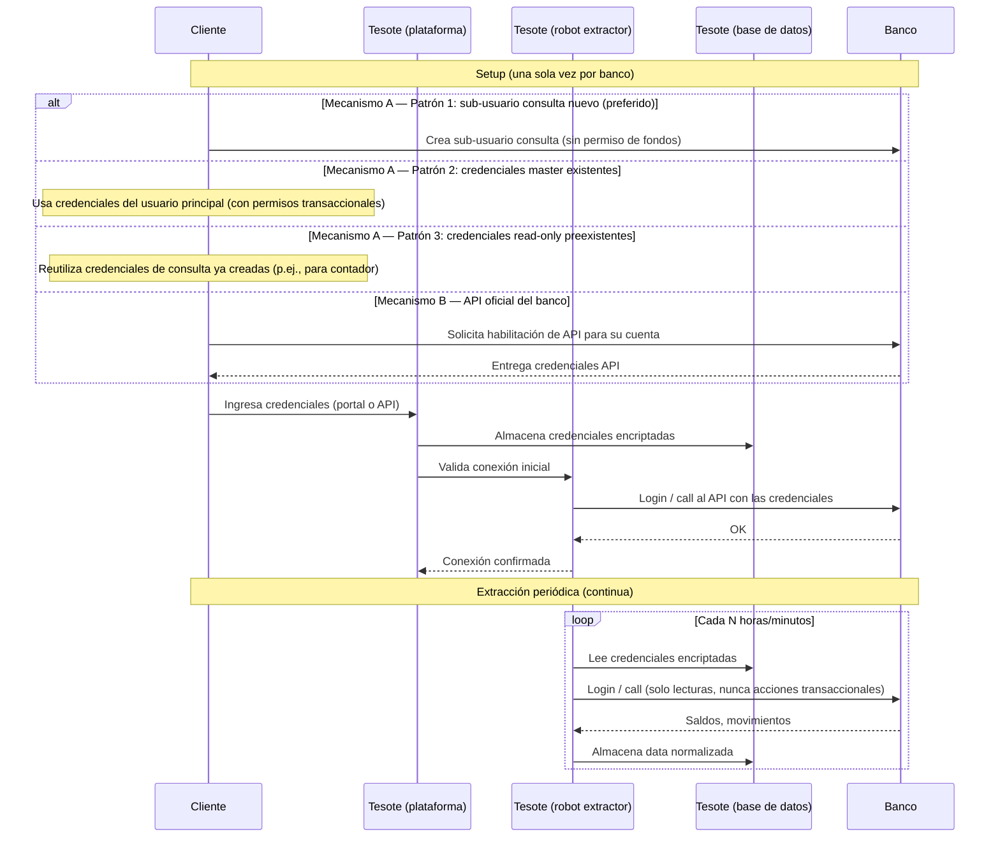
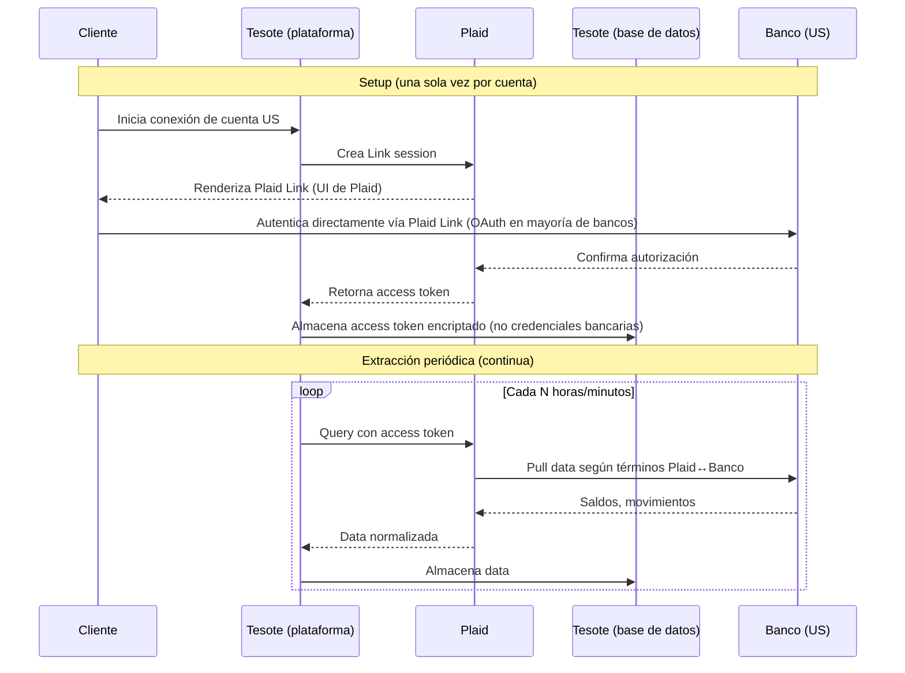

# Flujograma — Tesote Connect

**Producto**: Connect es el módulo de Tesote que permite a una empresa cliente conectar sus cuentas bancarias y extraer de forma programática y periódica su data financiera (saldos, movimientos, estados de cuenta), centralizándola en una base de datos propia de Tesote a la cual el cliente tiene acceso vía la plataforma web.

**Modelo comercial**: suscripción anual, facturación mensual, sin componente transaccional. *No hay movimiento de fondos en este producto.*

**Audiencia de este documento**: PTCK, Fase 1 (análisis regulatorio).
**Documento base**: [Tesote's Legal Affairs — April 2026](../../tesote-legal-affairs-april-2026.md), sección P0.2.
**Notas**: Los puntos marcados `[VERIFICAR]` requieren confirmación interna antes de enviar a PTCK.

---

## 1. Actores

| Actor | Rol |
|---|---|
| **Cliente** | Empresa B2B venezolana (con RIF, registro mercantil, contabilidad estructurada). Es quien firma el contrato con Tesote. |
| **Usuarios del cliente** | Personas físicas autorizadas por el cliente a usar la plataforma Tesote (CFO, contralor, contadores, tesorería). |
| **Tesote C-corp (Delaware)** | Entidad propietaria del software, contratante en algunos casos, custodio de la infraestructura tecnológica. |
| **Tesote VE** | Entidad venezolana, contratante en otros casos (decisión por cliente, no sistemática). Hoy sin relación societaria con la C-corp de Delaware. |
| **Banco** | Institución bancaria titular de la(s) cuenta(s) del cliente. Puede ser un **banco venezolano** (mayoría de los casos) o un **banco extranjero** — Panamá, República Dominicana, Estados Unidos u otras jurisdicciones del Caribe. La conexión se ofrece independientemente de la jurisdicción del banco. Tres mecanismos de integración coexisten (ver §2.2): (A) **scraping del portal web**, (B) **API oficial del banco**, (C) **Plaid (agregador de terceros)** — en bancos en EEUU. |
| **Plaid** | Agregador estadounidense de datos bancarios. Actúa como capa intermedia entre Tesote y los bancos en EEUU. Mantiene acuerdos directos con la mayoría de los bancos importantes de EEUU. Tesote es cliente de Plaid bajo el Plaid Developer Agreement; el cliente final autoriza directamente a Plaid (vía Plaid Link) sin compartir credenciales con Tesote. |

---

## 2. Flujo end-to-end

### 2.1 Onboarding comercial (offline)

1. Tesote y el cliente acuerdan los términos comerciales (precio anual, alcance de servicios contratados, número de cuentas, número de usuarios, etc.).
2. Las Partes firman el **Contrato de Prestación de Servicios (MSA)** — el contrato marco usado hoy es el adjunto a este expediente. Anexos:
   - **Anexo I** — alcance, funcionalidades, límites operativos, tarifas y condiciones de pago.
   - **Anexo II** — funcionalidades adicionales y tarifas de activación (hoy típicamente "sin contenido aplicable").
   - **Anexo III** — Módulo de cobros ("Tesote Cobros") (hoy típicamente "sin contenido aplicable"; reservado para el producto Payments cuando se active).
   - El MSA **incorpora por referencia los Términos y Condiciones publicados en la plataforma Tesote Web** (cláusula 14 del MSA). Esos T&C son un documento separado (no anexo al MSA) — se enviarán a PTCK aparte.
3. Cliente recibe factura mensual. Según el cliente, la factura es emitida por la **Tesote C-corp (Delaware)** (USD, sin pasar por fisco venezolano) o por **Tesote VE** (en bolívares, con factura formal). *Decisión cliente-por-cliente, sin patrón sistemático hoy. El MSA estándar tiene como parte contratante a la entidad VE — `[VERIFICAR]` si existe una variante de MSA con la C-corp como parte contratante o si esos clientes firman bajo el mismo template.*

### 2.2 Setup técnico — banco por banco

**Tres mecanismos de integración coexisten** según disponibilidad por banco / jurisdicción y elección del cliente:

- **Mecanismo A** — Scraping del portal con credenciales custodiadas por Tesote.
- **Mecanismo B** — API oficial del banco.
- **Mecanismo C** — Plaid (agregador de terceros) para bancos en EEUU.

Cada mecanismo tiene un perfil legal y regulatorio distinto. La lógica posterior al setup (extracción periódica, almacenamiento en DB Tesote, acceso del cliente vía dashboard) es la misma en los tres casos.

#### 2.2.1 Mecanismo A — Scraping del portal con credenciales custodiadas

Cliente entrega credenciales del portal web del banco a Tesote; Tesote las encripta y almacena; los robots de Tesote inician sesión en el portal y descargan la data. **Tres patrones de credenciales coexisten dentro de este mecanismo**:

1. **Sub-usuario consulta creado al onboarding (patrón preferido).** Tesote instruye al cliente a crear, dentro del portal del banco, un sub-usuario con permisos de solo consulta — sin atribuciones de movimiento de fondos. El sub-usuario solo puede ver saldos, movimientos, estados de cuenta. Es creado por el cliente directamente en el portal del banco; Tesote nunca interviene en esa creación. **Es el patrón que Tesote promueve activamente** porque limita la superficie de riesgo en caso de incidente con las credenciales.
2. **Credenciales del usuario master / principal.** En algunos casos el cliente entrega a Tesote las credenciales del usuario principal — credenciales que **sí tienen atribuciones de movimiento de fondos**. Tesote operativamente solo realiza acciones de consulta, pero técnicamente las credenciales tienen capacidad transaccional plena.
3. **Credenciales read-only preexistentes.** En otros casos el cliente reutiliza credenciales de solo consulta que ya tenía creadas antes de contratar a Tesote (por ejemplo, un usuario de consulta creado para su contador o para una herramienta previa). En esos casos no hay creación de sub-usuario nuevo; Tesote recibe credenciales ya existentes.

**Implicación regulatoria** (auto-análisis preliminar): los patrones 1 y 3 limitan la capacidad técnica de Tesote a "lectura". El patrón 2 le da a Tesote acceso técnico a acciones transaccionales que **operativamente nunca ejerce, pero técnicamente podría ejercer**. Este matiz es importante para el análisis de PTCK — la defensa "Tesote nunca toca los fondos" sigue siendo cierta operativamente, pero la defensa "Tesote no puede tocar los fondos" no es uniformemente sostenible.

`[VERIFICAR]` — porcentaje aproximado de clientes / cuentas que caen en cada uno de los tres patrones, idealmente desglosado por banco.

#### 2.2.2 Mecanismo B — API oficial del banco

Cuando el banco ofrece API oficial (hoy en VE aplica únicamente a **BNC**; algunos bancos extranjeros también la ofrecen), en lugar del patrón de scraping con credenciales de portal, el cliente solicita al banco la habilitación de las APIs para su cuenta. El banco entrega credenciales API al cliente, quien las comparte con Tesote (declarando a Tesote como "partner tecnológico" cuando el banco lo requiere). Tesote encripta y almacena dichas credenciales. La consulta se hace contra los endpoints oficiales del banco.

`[VERIFICAR]` — alcance de las atribuciones del API en cada banco que la ofrece (¿solo consulta? ¿también acciones transaccionales?). Para BNC, el API incluye atribuciones transaccionales (relevante para Payments, no para Connect, pero las credenciales son las mismas).

`[VERIFICAR]` — listado de bancos extranjeros donde Tesote usa API oficial (vs. Mecanismo A o C).

#### 2.2.3 Mecanismo C — Plaid (agregador de terceros) para bancos en EEUU

Para cuentas de clientes en bancos de Estados Unidos, Tesote usa **Plaid** como capa intermedia. Plaid es un agregador estadounidense de datos bancarios con acuerdos firmados con la mayoría de los bancos importantes de EEUU. El flujo es distinto en aspectos relevantes:

1. **Autenticación directa cliente↔banco vía Plaid Link.** Cuando el cliente conecta una cuenta US, la plataforma Tesote le presenta el flujo de Plaid Link. El cliente se autentica directamente con su banco a través de la interfaz de Plaid, ingresando sus credenciales en la UI de Plaid (no en la UI de Tesote). En la mayoría de los bancos importantes de EEUU, este flujo es OAuth — el cliente es redirigido al portal de su propio banco y autoriza el acceso ahí.
2. **Tesote no recibe ni almacena las credenciales del banco.** Plaid retorna a Tesote un **access token** por la cuenta autorizada. Tesote encripta y almacena el token, no las credenciales bancarias.
3. **Las consultas periódicas se hacen contra la API de Plaid**, no contra el banco directamente. Plaid relays con el banco según los términos negociados entre Plaid y cada banco.
4. **Tesote es cliente de Plaid bajo el Plaid Developer Agreement**. Esto implica obligaciones contractuales hacia Plaid (uso permitido de la data, retención, security standards, etc.) que se suman a las obligaciones de Tesote frente al cliente.

**Implicación regulatoria** (auto-análisis preliminar): este mecanismo es estructuralmente más limpio que el A en varios ejes:
- Tesote **no custodia credenciales bancarias** del cliente → reduce dramáticamente la superficie de riesgo de credential leakage.
- Plaid es la entidad regulada que mantiene la relación con cada banco (Plaid está sujeto a regulación financiera de EEUU — GLBA, FTC Act, leyes estatales tipo CCPA, etc.) → corrimiento de obligaciones regulatorias hacia Plaid en la jurisdicción US.
- A cambio, **se introduce un tercero en la cadena de procesamiento de datos** (Plaid es un sub-procesador de facto). Esto añade un eje adicional al análisis de territorialidad y al DPA del cliente.

`[VERIFICAR]`:
- Porcentaje de clientes / cuentas en EEUU que están en Plaid vs. cualquier otro mecanismo.
- Estado del Plaid Developer Agreement firmado por Tesote (cuál entidad firmó: C-corp Delaware o VE) y obligaciones materiales asumidas.
- Si Plaid se utiliza también para alguna jurisdicción no-US (Plaid soporta UK / EU / Canadá; revisar si Tesote lo aprovecha).

#### 2.2.4 Captura, encriptación y validación (común a los tres mecanismos)

Independientemente del mecanismo:

1. **Captura en Tesote**. El cliente ingresa credenciales (mecanismos A y B) o autentica vía Plaid Link (mecanismo C) desde la UI de la plataforma Tesote.
2. **Encriptación y almacenamiento**. Tesote encripta y almacena lo que corresponda — credenciales para A y B, access token de Plaid para C — en su base de datos.
   - `[VERIFICAR]` — esquema de cifrado (algoritmo, gestión de llaves, KMS).
   - `[VERIFICAR]` — ubicación física de la infraestructura (proveedor cloud, región).
3. **Validación inicial**. Tesote ejecuta una primera conexión de prueba para confirmar acceso válido; si falla, se notifica al cliente.

### 2.3 Extracción periódica

1. Procesos automatizados (en adelante, "robots" o "jobs") corren en la infraestructura de Tesote a frecuencia `[VERIFICAR — diaria? cada N minutos?]`.
2. Cada job, según el mecanismo:
   - **Mecanismo A (scraping)**: desencripta las credenciales, inicia sesión en el portal del banco autenticándose como el usuario correspondiente al patrón (1, 2 o 3 de §2.2.1), descarga la data y cierra sesión.
   - **Mecanismo B (API banco)**: desencripta las credenciales API e invoca los endpoints oficiales del banco.
   - **Mecanismo C (Plaid)**: desencripta el access token de Plaid e invoca los endpoints de Plaid; Plaid relays con el banco.
3. En todos los casos se descargan saldos, movimientos del período, y eventuales documentos descargables (estados de cuenta, comprobantes).
4. La data descargada se normaliza al modelo de datos de Tesote y se inserta en la base de datos propia de Tesote (`[VERIFICAR]` — ubicación física del DB).
5. Si la conexión falla (cambio de portal, bloqueo del banco, credenciales/token expirados, OTP requerido), el job levanta una alerta interna y notifica al cliente para refrescar.

### 2.4 Acceso del cliente a su data

1. El cliente y sus usuarios autorizados acceden a la plataforma Tesote vía web (login con email/password + factor adicional).
2. La plataforma muestra:
   - Saldos consolidados por banco y por cuenta.
   - Movimientos históricos.
   - Reportes (flujo de caja, conciliación, etc.).
   - Exportes (Excel, CSV) — la data se descarga del DB de Tesote, no del banco directamente.
3. `[VERIFICAR]` — ¿qué controles internos existen sobre quién en Tesote puede ver la data del cliente? (separación de roles, logging de accesos administrativos).

### 2.5 Revocación / offboarding

1. El cliente puede en cualquier momento, desde la plataforma Tesote:
   - **Mecanismos A y B**: eliminar credenciales → Tesote borra las credenciales encriptadas y suspende los jobs para esa cuenta.
   - **Mecanismo C (Plaid)**: revocar la conexión → Tesote invoca el endpoint correspondiente de Plaid para invalidar el access token, lo borra de su DB y suspende los jobs.
2. El cliente puede también revocar directamente desde fuera de Tesote:
   - **Mecanismos A y B**: eliminar el sub-usuario consulta o las credenciales API desde el portal/back-office del banco → cualquier intento posterior de Tesote de conectarse falla silenciosamente.
   - **Mecanismo C (Plaid)**: revocar el consentimiento desde el dashboard de Plaid del cliente o desde el portal del banco (cuando el banco ofrece esa opción) → Plaid notifica a Tesote vía webhook y los jobs dejan de funcionar.
3. Cancelación del contrato → al cierre del ciclo, Tesote `[VERIFICAR]` — política exacta — borra/anonimiza la data del cliente o la conserva por X tiempo según obligación de retención.

---

## 3. Diagramas (secuencias técnicas por mecanismo)

### 3.1 Mecanismos A y B — credenciales custodiadas por Tesote

### 3.2 Mecanismo C — Plaid (bancos en EEUU)

*(El consumo de data por parte del cliente — login a Tesote, dashboards, exportes — es común a los tres mecanismos y está descrito en §2.4. Para mantener legibilidad de los diagramas, no se repite aquí.)*

---

## 4. Inventario de datos

| Dato | Origen | ¿Encriptado? | Retención |
|---|---|---|---|
| Credenciales bancarias (sub-usuario consulta nuevo, master, read-only preexistente, o API según banco) | Cliente las ingresa | Sí | Mientras dure el contrato; borradas al revocar |
| Saldos por cuenta | Banco (vía robot, API oficial, o Plaid según mecanismo) | `[VERIFICAR]` (en tránsito + reposo) | Histórico completo durante el contrato |
| Movimientos / transacciones | Banco (vía robot, API oficial, o Plaid según mecanismo) | `[VERIFICAR]` | Histórico completo durante el contrato |
| Estados de cuenta (PDF) | Banco (cuando descargables) | `[VERIFICAR]` | `[VERIFICAR]` |
| Plaid access tokens (mecanismo C) | Retornados por Plaid post-autenticación del cliente | Sí, encriptados | Mientras dure la conexión; revocados al desconectar la cuenta |
| Datos del cliente (RIF, razón social, contactos) | Cliente al onboarding | `[VERIFICAR]` | Mientras dure el contrato + obligación de retención fiscal |
| Logs de acceso a la plataforma | Sistema | N/A | `[VERIFICAR]` |

---

## 5. Base contractual

Mapeo de las cláusulas del MSA actual (versión "TST SERVICIOS Y CONSULTORIA, C.A.") a los pasos del flujo descrito arriba. Citas a número de cláusula del contrato adjunto.

- **Cláusula 1 — Alcance de los Servicios.** Define los Servicios como acceso a la plataforma SaaS Tesote Web "para la visualización, consolidación de saldos y transacciones bancarias de las cuentas vinculadas por el Cliente". **Posicionamiento regulatorio explícito**: "TESOTE actúa exclusivamente como proveedor tecnológico. No es una entidad financiera ni gestiona, ni ejecuta ni intermedia transacciones bancarias o movimientos de fondos en nombre del Cliente." → Esta es la línea de defensa principal frente a la regulación fintech para Connect.
- **Cláusula 5 — Obligaciones de TESOTE.** Incluye "Implementar medidas técnicas y organizativas razonables para proteger la información y los Datos del Cliente."
- **Cláusula 6 — Obligaciones del Cliente.** Incluye mantener confidencialidad de credenciales de acceso a la plataforma, uso lícito de los Servicios, etc.
- **Cláusula 7 — Confidencialidad.** Obligación recíproca de confidencialidad sobre información no pública. **Sobrevive cinco (5) años post-terminación.** No menciona específicamente la data bancaria del cliente como categoría especial; aplica el régimen general de "Información Confidencial".
- **Cláusula 8 — Propiedad de Datos.** "El Cliente conservará en todo momento la propiedad y todos los derechos sobre los datos que proporcione o genere en el marco de la utilización de los servicios. TESOTE únicamente accederá o compartirá los datos del Cliente cuando sea estrictamente necesario para la prestación de los servicios... o en cumplimiento de una obligación legal o requerimiento de autoridad competente. TESOTE no utilizará los datos del Cliente para ningún otro propósito sin el consentimiento previo y por escrito del Cliente." → Esta es la cláusula que informalmente referenciamos como "no comercialización", aunque el MSA **no usa el término "comercialización" ni la palabra "vender"** explícitamente. Punto a discutir con PTCK.
- **Cláusula 9 — Limitación de Responsabilidad.** Tesote no responde por: (a) fallas en sistemas bancarios o calidad de data de terceros; (b) mal manejo de credenciales por parte del cliente; (c) daños indirectos / consecuenciales / pérdida de ingresos.
- **Cláusula 10 — Propiedad Intelectual.** "La Plataforma Tesote Web, incluyendo su software, diseño, procesos, metodologías, documentación y marcas, son y seguirán siendo propiedad exclusiva de TESOTE." Como TESOTE en este MSA = TST SERVICIOS Y CONSULTORIA, C.A. (entidad VE), el contrato **atribuye la titularidad de IP a la entidad VE**. → Inconsistente con la realidad operativa entendida por los founders y con el preámbulo de los Anexos (ver §7.8 abajo). Punto crítico para PTCK.
- **Cláusula 14 — T&C por referencia.** Los T&C publicados en la plataforma forman parte del MSA por referencia. "En caso de discrepancia entre lo dispuesto en este Contrato y los Términos y Condiciones, prevalecerán las disposiciones de este Contrato." Los T&C como tales no han sido incluidos aquí — se envían aparte para revisión de PTCK.
- **Cláusula 15 — Ley aplicable y jurisdicción.** **Leyes del Estado de Florida, EE.UU., y jurisdicción exclusiva de tribunales de Florida.** → Combinación inusual con una parte contratante VE. Punto para PTCK.

### Lo que *no está* explícito en el MSA y debería estar (gaps)

Estos puntos son lo que la conversación operativa sugiere que existe pero el MSA actual **no contiene de forma expresa**. Los listo para que PTCK los aborde en el rediseño contractual de Fase 2:

- **Autorización expresa para que Tesote acceda al portal del banco usando credenciales provistas por el cliente.** El MSA describe el servicio como "visualización de saldos y transacciones de las cuentas vinculadas", pero no hay una cláusula que diga "el Cliente autoriza expresamente a TESOTE a iniciar sesión en su nombre en los portales bancarios usando las credenciales del sub-usuario consulta que el Cliente proporcione". Este es un gap importante a la luz de la zona gris regulatoria.
- **Cláusula expresa de "no venta / no comercialización" de data.** La cláusula 8 es defensiva pero pasiva ("no utilizará para otros fines sin consentimiento"). No hay un compromiso explícito de no monetizar la data, ni siquiera en forma agregada o anonimizada.
- **Política de retención y borrado post-terminación.** El MSA habla de la terminación del servicio (cláusula 3) pero no especifica qué pasa con la data del cliente después: ¿plazo de borrado? ¿formato de exportación garantizado? ¿retención obligatoria por X tiempo por requerimientos fiscales o regulatorios?
- **Localización del procesamiento de datos** (data residency). No se especifica dónde se procesan ni dónde residen los datos. Relevante para territorialidad regulatoria (ver §7.4).
- **Data Processing Agreement (DPA) / cláusulas LOPPCI específicas.** No hay un DPA separado ni cláusulas detalladas sobre rol de tratamiento de datos personales.
- **Notificación de incidentes de seguridad.** No hay obligación expresa de notificar al cliente en caso de breach de seguridad ni plazos para hacerlo.
- **Auditoría y derechos del cliente sobre sus credenciales.** No hay cláusula sobre el derecho del cliente a auditar el manejo de sus credenciales, ni sobre el procedimiento que debe seguir Tesote si recibe un requerimiento de autoridad sobre la data del cliente.

---

## 6. Variantes y casos especiales

- **BNC vía API oficial (Mecanismo B en VE)**. Único banco *venezolano* con integración vía APIs oficiales hoy. Tesote actúa como "partner tecnológico" del cliente; **no hay contrato directo entre Tesote y BNC**. BNC entrega las credenciales al cliente, el cliente se las pasa a Tesote.
- **Bancos en EEUU (Mecanismo C — Plaid)**. Tesote utiliza Plaid como capa intermedia. Tesote no custodia credenciales bancarias; almacena solo el access token retornado por Plaid. Tesote es cliente de Plaid bajo el Plaid Developer Agreement. Ver §2.2.3.
- **Bancos extranjeros no-EEUU (Panamá, RD, Caribe)**. Tesote conecta cuentas de clientes en estos bancos típicamente vía Mecanismo A (scraping con credenciales) y eventualmente Mecanismo B cuando el banco ofrece API. El flujo lógico es similar al doméstico, pero implica **flujo transfronterizo de data** y **múltiples jurisdicciones bancarias** sobre el mismo cliente. `[VERIFICAR]` — listado actual de jurisdicciones cubiertas, mecanismo predominante por jurisdicción, y % de clientes con cuentas extranjeras.
- **Bancos sin sub-usuario consulta** y/o clientes que no quieren/pueden crearlo. `[VERIFICAR]` — qué bancos no soportan sub-usuarios de consulta y qué porcentaje de los casos donde se usa "credenciales master" (patrón 2 de §2.2.1) se debe a esa limitación bancaria vs. a preferencia o conveniencia del cliente.
- **Multi-banco para un mismo cliente**. Un cliente típico conecta 2–10 bancos, frecuentemente en múltiples jurisdicciones (VE + offshore). Cada banco requiere su propio setup, sus propias credenciales, su propio sub-usuario.
- **Acceso adicional al ERP del cliente**. Algunos clientes adicionalmente nos conectan a su ERP para extraer data de facturación. **Este flujo se trata en flujograma separado: Tesote Automations.**
- **Generación de alertas y notificaciones**. `[VERIFICAR]` — ¿Tesote envía alertas vía email / WhatsApp al cliente sobre movimientos detectados? Si sí, agregar al diagrama.

---

## 7. Disparadores regulatorios potenciales (auto-análisis preliminar)

Esta sección es **mi propio mapeo preliminar** de elementos que podrían levantar banderas. PTCK debe validar/corregir.

1. **Captación de datos financieros sensibles**. Aunque no manejamos fondos, el hecho de procesar saldos y movimientos bancarios podría ubicarnos en el "supuesto amplio" de la regulación fintech de Sudeban. *Pregunta explícita a PTCK.*
2. **Custodia de credenciales bancarias**. Almacenar credenciales — incluso encriptadas — implica responsabilidades de ciberseguridad. ¿Existe alguna obligación específica bajo regulación venezolana (BCV, Sudeban, LOPPCI) sobre custodia de credenciales de terceros? **Adicionalmente**: en una porción de los casos las credenciales son de usuario master (con atribuciones transaccionales completas) — ¿esto eleva el estándar de cuidado o la categorización regulatoria respecto al caso de credenciales de solo consulta? Ver §2.2.1 para los tres patrones.
3. **Acceso programático sin contrato con el banco**. Para los bancos no-BNC, no tenemos contrato con el banco; nos amparamos en el consentimiento del cliente. ¿Riesgo de que un banco pueda alegar incumplimiento de sus términos y condiciones por nuestro acceso automatizado? ¿Cómo se mitiga?
4. **Territorialidad multi-jurisdicción**. El análisis no es solamente VE-vs-fuera-de-VE. Hay cuatro ejes que pueden divergir: (a) jurisdicción del cliente (típicamente VE), (b) jurisdicción del banco fuente (VE + Panamá, RD, EEUU, Caribe), (c) jurisdicción de la infraestructura técnica de Tesote (`[VERIFICAR]`), (d) **cuando aplica el Mecanismo C, jurisdicción de Plaid (EEUU)** como sub-procesador de facto. Cuando los datos viajan de un banco extranjero hacia un cliente VE pasando por infra de Tesote y eventualmente por Plaid, múltiples regímenes de protección de datos y ciberseguridad podrían aplicar simultáneamente.
5. **Doble facturación (C-corp US vs VE)**. La elección cliente-por-cliente entre facturar desde la C-corp de Delaware o desde Tesote VE no responde a una lógica jurídica/fiscal estructurada. ¿Riesgo en términos de territorialidad fiscal y de exposición de la entidad VE?
6. **Cláusula de no-comercialización de data**. Validar que la cláusula actual sea suficiente bajo el marco LOPPCI (precario en VE, pero existente).
7. **Acceso interno de Tesote a la data del cliente**. ¿Existe obligación regulatoria de implementar separación de roles, logs auditables de acceso administrativo, etc.?
8. **Inconsistencia interna del MSA respecto a la entidad contratante**. El cuerpo del MSA identifica como "TESOTE" a **TST SERVICIOS Y CONSULTORIA, C.A.** (entidad VE). Sin embargo, el preámbulo de los Anexos del mismo documento dice: *"Documento parte integrante del Contrato celebrado entre TESOTE TECHNOLOGIES INC. y el Cliente identificado en dicho Contrato."* → Dos entidades distintas referenciadas dentro del mismo documento contractual. Riesgo de invalidación parcial, ambigüedad probatoria, exposición fiscal cruzada. Punto crítico para PTCK.
9. **Atribución de IP a la entidad VE**. Por la cláusula 10, la titularidad de Tesote Web (software, diseño, marcas) queda en la entidad VE. La realidad operativa y comercial entiende que la IP es de la C-corp de Delaware. Inconsistencia que cruza directamente con la P2.1 del documento maestro (limpieza de cadena de cesión de IP).
10. **Ley de Florida con parte contratante VE**. La cláusula 15 somete el contrato a leyes de Florida y jurisdicción exclusiva de tribunales de Florida, pero la parte contratante por Tesote es la entidad VE. ¿Combinación viable o vulnerable? ¿Qué pasaría en caso de disputa real?
11. **Plaid como sub-procesador y obligaciones contractuales hacia Plaid**. Bajo el Mecanismo C, Plaid actúa como un sub-procesador de hecho. (a) ¿El MSA actual con el cliente le informa de la existencia de sub-procesadores? (No lo hace explícitamente.) (b) Tesote asume obligaciones contractuales hacia Plaid (Plaid Developer Agreement) que pueden no estar reflejadas operativamente — `[VERIFICAR]`. (c) Cuál entidad firmó el Plaid Developer Agreement (C-corp Delaware o VE) — si lo firmó la VE, hay otra capa de inconsistencia con la presencia operativa.

---

## 8. Preguntas explícitas para PTCK

1. **¿Connect — por sí solo, sin manejo de fondos — cae dentro de algún supuesto de la regulación fintech de Sudeban?** Si sí, ¿cuál y bajo qué interpretación?
2. **¿La cláusula de "no comercialización de data" es suficiente bajo LOPPCI?** ¿Recomiendan ajustes específicos al lenguaje?
3. **Sobre el acceso programático a portales bancarios sin contrato con el banco**: ¿cuál es el nivel de riesgo real (probabilidad × magnitud) de que algún banco accione legalmente? ¿Recomiendan algún cambio operativo o contractual para mitigar?
4. **Sobre la custodia de credenciales bancarias**: ¿existen estándares específicos exigidos por la regulación venezolana? ¿O nos guiamos por buenas prácticas internacionales (ISO 27001, SOC 2, etc.)? Específicamente en los casos donde Tesote custodia credenciales master con atribuciones transaccionales completas (patrón 2 de §2.2.1) — ¿se eleva el estándar regulatorio aplicable, o sigue siendo el mismo régimen que para credenciales de consulta?
5. **Sobre territorialidad y multi-jurisdicción bancaria**: el producto conecta tanto bancos venezolanos como bancos en Panamá, República Dominicana, EEUU y otras jurisdicciones del Caribe. (a) ¿El análisis regulatorio venezolano cambia cuando los datos provienen también de bancos extranjeros? (b) ¿El hecho de que la infraestructura técnica esté fuera de VE — si así lo confirmamos — atenúa o agrava el análisis? (c) ¿Hay regímenes de las jurisdicciones bancarias extranjeras que debamos preocuparnos hoy (sea directamente o vía counsel local en esas plazas)?
6. **Sobre la facturación dual (C-corp US vs VE) para el mismo producto**: ¿qué riesgos vemos hoy? ¿Cuál es la estructura ideal a futuro? *Esta pregunta se conecta directamente con la recomendación de estructura corporativa (P2.1 del documento maestro).*
7. **Sobre la relación con BNC**: ¿el hecho de tener una integración técnica vía API oficial — sin contrato comercial — nos crea alguna exposición? ¿Recomiendan formalizar de alguna forma?
8. **Sobre el MSA actual** (revisión expresa solicitada en Fase 2, pero relevante también para Fase 1):
   - (a) ¿La cláusula 1 ("proveedor tecnológico, no entidad financiera") es defensa suficiente bajo el supuesto amplio de la regulación fintech, o necesita reforzarse con lenguaje adicional?
   - (b) ¿La cláusula 8 (propiedad de datos / uso restringido) es suficiente bajo LOPPCI, o necesita un DPA separado y/o cláusula expresa de no-comercialización?
   - (c) ¿La inconsistencia entre TST SERVICIOS Y CONSULTORIA, C.A. (cuerpo del MSA) y TESOTE TECHNOLOGIES INC. (preámbulo de Anexos) crea un problema real de ejecutabilidad? ¿Cómo se corrige limpio?
   - (d) ¿La elección de ley de Florida y jurisdicción exclusiva de Florida es defendible con una parte contratante VE? ¿Recomendarían cambiar?
   - (e) Gaps explícitamente identificados en §5: autorización expresa de uso de credenciales, no-comercialización, retención post-terminación, data residency, DPA, notificación de incidentes. ¿Cuáles son prioridad inmediata vs. Fase 2?
9. **Sobre el uso de Plaid como agregador para bancos en EEUU**:
   - (a) ¿El uso de Plaid como sub-procesador de hecho atenúa o elimina los disparadores regulatorios venezolanos para las cuentas en EEUU (dado que Tesote no custodia credenciales bancarias en este mecanismo)?
   - (b) ¿El MSA actual debería disclosar expresamente el uso de Plaid (y otros sub-procesadores) al cliente? ¿Hay obligación bajo LOPPCI o buenas prácticas internacionales?
   - (c) Bajo el Plaid Developer Agreement, Tesote asume obligaciones específicas hacia Plaid (uso permitido de la data, retención, security standards). ¿Existe algún riesgo de fricción entre esas obligaciones y el régimen contractual con el cliente final?
   - (d) Si el Plaid Developer Agreement fue firmado por la entidad incorrecta (p.ej., VE cuando debería ser la C-corp), ¿qué exposición crea y cómo se rectifica?

---

## 9. Pendientes internos antes de enviar a PTCK

- [ ] Verificar todos los puntos `[VERIFICAR]` con el equipo de ingeniería + producto.
- [ ] Confirmar política operativa actual de retención post-terminación (no aparece en el MSA).
- [ ] Confirmar bancos donde el patrón de "sub-usuario consulta" no es posible.
- [ ] Estimar porcentaje de clientes/cuentas en cada uno de los tres patrones de credenciales del Mecanismo A (sub-usuario consulta nuevo / master / read-only preexistente). Idealmente desglosado por banco.
- [ ] Distribución de cuentas por mecanismo de integración (A / B / C) y por jurisdicción del banco.
- [ ] Listar jurisdicciones bancarias actualmente cubiertas (VE + extranjeras) y porcentaje de clientes con cuentas offshore — útil para que PTCK dimensione el alcance del análisis territorial.
- [ ] Confirmar cuál entidad de Tesote firmó el **Plaid Developer Agreement** (C-corp Delaware o VE). Si fue la VE, evaluar rectificación.
- [ ] Adjuntar el Plaid Developer Agreement vigente para revisión de PTCK.
- [ ] Enviar a PTCK aparte: (a) MSA estándar, (b) T&C de la plataforma incorporados por referencia, (c) si existe, variante del MSA con la C-corp Delaware como parte contratante, (d) Plaid Developer Agreement.
- [ ] Confirmar internamente cuál entidad (C-corp Delaware o VE) firma efectivamente con cada cliente hoy y bajo qué template.
- [ ] Convertir el diagrama mermaid en una versión formal (Lucidchart / Whimsical) para envío.
- [ ] Decidir si esta versión va en español únicamente o si enviamos también traducción al inglés (PTCK trabaja en español; los founders necesitan poder revisar).

---

## Referencias

- [Brief maestro de asuntos legales — abril 2026](../../tesote-legal-affairs-april-2026.md)
- [Recap del kickoff PTCK — 2026-04-29](../ptck-kickoff-2026-04-29.md)
- Próximos flujogramas: `../Tesote Automations/flujograma-automations.md`, `../Tesote Payments/flujograma-payments.md` (en preparación)
