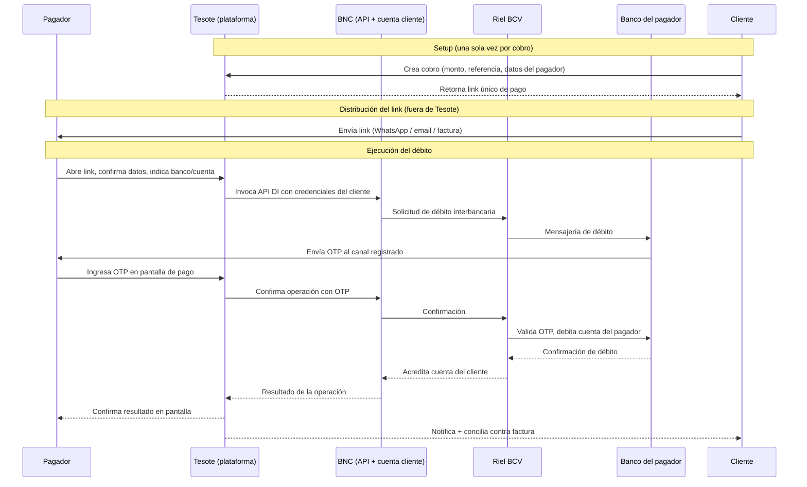
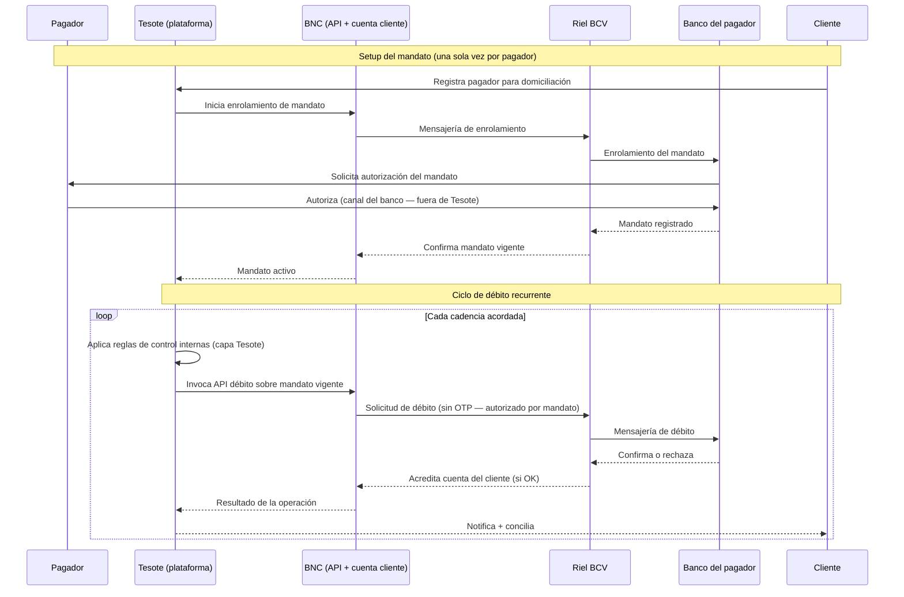
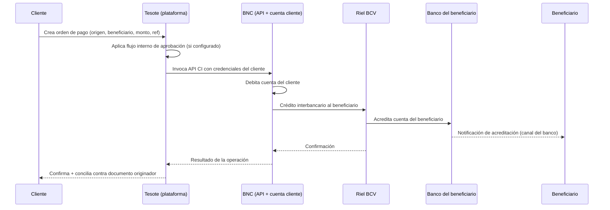

# Flujograma — Tesote Payments

**Producto**: Payments es el módulo de Tesote que permite a una empresa cliente **cobrar** (recibir pagos de terceros) y **pagar** (enviar transferencias a terceros) desde sus cuentas en **BNC**, utilizando los rieles de pago interbancarios del BCV — **Débito Inmediato (DI)** y **Crédito Inmediato (CI)** — expuestos a través del API oficial de BNC. Tesote actúa como capa de orquestación, experiencia de usuario y conciliación; no custodia ni mueve fondos en ninguna cuenta propia.

**Modelo comercial**: tarifa por transacción (en diseño) y/o componente bundled con la suscripción SaaS de Tesote (Connect + Automations). El pricing específico está en definición.

**Audiencia de este documento**: PTCK, Fase 1 (análisis regulatorio).
**Documento base**: [Tesote's Legal Affairs — April 2026](../tesote-legal-affairs-april-2026.md), sección P0.1.
**Documentos relacionados**:
- [Flujograma — Tesote Connect](../Tesote%20Connect/flujograma-connect-ptck.md) — Connect ya cubre el uso del API oficial de BNC en sus endpoints de **lectura** (saldos, movimientos). Payments utiliza el **mismo API y las mismas credenciales**, agregando los endpoints **transaccionales** (DI y CI).
- [Recap del kickoff PTCK — 2026-04-29](../ptck-kickoff-2026-04-29.md) — captura las distinciones regulatorias preliminares planteadas por PTCK: domiciliación como régimen BCV (no Sudeban fintech), OTP-débito como zona gris, alianza vs. partner-tecnológico.

**Notas**: Algunos detalles operativos (porcentaje de transacciones por flujo, KPIs de producción del piloto B2C, esquema específico de cifrado, RTO/RPO, ubicación de infraestructura) están en confirmación interna en Tesote y se completarán en una versión posterior de este documento.

**Alcance del flujograma**: BNC en Venezuela, exclusivamente. Tesote Payments no opera hoy con otros bancos venezolanos ni con bancos extranjeros. Cualquier expansión a un segundo banco se documentará en un flujograma separado.

---

## 1. Actores

| Actor | Rol |
|---|---|
| **Cliente** | Empresa B2B venezolana (con RIF, registro mercantil, contabilidad estructurada). Es titular de una cuenta en BNC y firma el contrato con Tesote. Según el flujo, actúa como **beneficiario / recaudador** (en Collect / DI) o como **ordenante / pagador** (en Send / CI). |
| **Usuarios del cliente** | Personas físicas autorizadas por el cliente a operar la plataforma Tesote (CFO, contralor, contadores, tesorería). En flujos transaccionales pueden tener distintos roles internos (quien inicia un pago, quien aprueba, quien consulta). |
| **Contraparte (pagador / beneficiario externo)** | Tercero al otro lado de la transacción. En **Collect / DI** es el **pagador**, que puede ser una persona natural (titular de cuenta en cualquier banco venezolano que opere DI) o, una vez que BNC habilite el flujo OTP para cuentas jurídicas, una persona jurídica. En **Send / CI** es el **beneficiario externo** designado por el cliente. **La contraparte no es cliente de Tesote**: no firma contrato con Tesote, no se autentica en la plataforma Tesote, su única interacción con Tesote (en el flujo Collect) es la pantalla de pago publicada por Tesote y la pantalla OTP servida por su propio banco. |
| **Tesote C-corp (Delaware)** | Entidad propietaria del software, custodio de la infraestructura tecnológica. |
| **Tesote VE** | Entidad venezolana, contratante en la mayoría de casos bajo el MSA estándar (TST SERVICIOS Y CONSULTORIA, C.A.). Hoy sin relación societaria con la C-corp de Delaware. *Punto de inconsistencia estructural ya identificado en el flujograma de Connect (§5) y en P2.1 del documento maestro; no se repite aquí el análisis.* |
| **BNC** | Banco Nacional de Crédito. Institución bancaria venezolana, regulada por Sudeban, titular de las licencias bancarias relevantes y operadora directa del API que Tesote consume. BNC es la **rail provider** del producto: el API expone los endpoints de DI (débito inmediato OTP), CI (crédito inmediato push) y domiciliación. **El cliente es titular de cuenta en BNC**; los movimientos contables ocurren contra esa cuenta. **No existe contrato comercial entre Tesote y BNC**: la relación de Tesote con BNC es la de "partner tecnológico" del cliente (Tesote opera contra el API utilizando las credenciales API que BNC entrega al cliente y que el cliente comparte con Tesote, declarando a Tesote como su partner). |
| **BCV (Banco Central de Venezuela)** | Operador de los rieles interbancarios (CCE / CCAE-electrónico) sobre los cuales viajan los Créditos Inmediatos y Débitos Inmediatos entre bancos. Tesote no se conecta directamente al BCV: lo hace a través del API de BNC, que actúa como el participante directo del riel. El rol del BCV es relevante regulatoriamente (la **domiciliación** está regulada por marco BCV, no por marco Sudeban-fintech — distinción planteada por PTCK en el kickoff). |
| **Banco del pagador / banco del beneficiario externo (interbank)** | Cualquier otro banco venezolano participante de los rieles BCV. En Collect, es donde el pagador tiene su cuenta de origen (fondos salen de ahí, autorizados vía OTP enviado por ese mismo banco a un canal del pagador). En Send, es donde el beneficiario externo tiene su cuenta de destino (fondos llegan ahí). Tesote **no** se conecta a estos bancos: la liquidación y la mensajería interbancaria son responsabilidad del riel BCV operado a través de BNC. |

---

## 2. Flujo end-to-end

### 2.1 Onboarding comercial (offline)

1. Tesote y el cliente acuerdan los términos comerciales del módulo Payments — alcance del producto contratado (Collect, Send, o ambos), número de cuentas BNC habilitadas, límites operativos, esquema de tarifas.
2. Las Partes firman (o **firman addendum a**) el **Contrato de Prestación de Servicios (MSA)** ya descrito en el flujograma de Connect (§5). El MSA incluye un **Anexo III — "Tesote Cobros"** específicamente reservado para Payments. Hoy, en los pocos clientes piloto activos, el Anexo III está siendo completado contractualmente; muchos clientes legacy lo tienen "sin contenido aplicable" porque fueron onboardeados antes de la disponibilidad del módulo.
3. **Habilitación del API de BNC para la cuenta del cliente**. El cliente solicita a BNC, por sus canales habituales (oficial de cuenta, back-office BNC), la habilitación del API para su cuenta. BNC emite las **credenciales API** y las entrega al cliente. El cliente comparte las credenciales con Tesote, declarando a Tesote como su "partner tecnológico" cuando BNC lo requiere. Tesote encripta y almacena las credenciales API en su base de datos. *Las mismas credenciales API son las que ya usa el módulo Connect (Mecanismo B en el flujograma de Connect §2.2.2). Lo que cambia entre Connect y Payments es únicamente el conjunto de endpoints invocados: Connect usa los endpoints de lectura; Payments adiciona los endpoints transaccionales (DI / CI / domiciliación). Por contrato bajo el MSA, Tesote sólo invoca los endpoints transaccionales si el cliente ha contratado Payments y para los flujos específicamente autorizados por el cliente.*
4. **Validación inicial**. Tesote ejecuta una primera prueba de conectividad y de capacidad transaccional (transacción de monto mínimo o consulta de status) para confirmar que el API responde y que los permisos están activos. Si falla, se notifica al cliente.
5. Cliente recibe factura mensual por la suscripción de Payments + tarifas transaccionales acumuladas (modelo de facturación en definición; hoy típicamente pre-acuerdo con cada cliente piloto). La entidad emisora de la factura sigue el mismo patrón cliente-por-cliente que Connect (Tesote VE en bolívares con factura formal, o Tesote C-corp Delaware en USD). *Misma observación de inconsistencia estructural que en Connect — referencia §5 del flujograma de Connect.*

### 2.2 Modos de operación

Payments expone **tres flujos transaccionales** que coexisten en el mismo API de BNC. El cliente puede activar uno, dos o los tres según su caso de uso. Cada flujo tiene un perfil regulatorio distinto.

- **Flujo 1 — Collect / Débito Inmediato con autorización OTP** (§2.3): el pagador autoriza un débito puntual desde su cuenta hacia la cuenta del cliente en BNC, ingresando un OTP que su propio banco le envía. **Status hoy**: en producción para pagadores con cuentas de **persona natural** (B2C); **bloqueado a nivel de habilitación bancaria** para cuentas de **persona jurídica** (B2B) — ver §6.1.
- **Flujo 2 — Collect / Domiciliación** (§2.4): el pagador autoriza, una sola vez y por adelantado, un **mandato de domiciliación** que permite débitos recurrentes desde su cuenta hacia la cuenta del cliente. Tesote orquesta el ciclo de débitos según la cadencia y los montos acordados con el cliente (recaudador). **Status hoy**: en QA con BNC contra los principales bancos pagadores (matriz de validación interbancaria conjunta acordada con BNC el 2026-05-04).
- **Flujo 3 — Send / Crédito Inmediato** (§2.5): el cliente, desde la plataforma Tesote, instruye una transferencia saliente desde su propia cuenta BNC hacia la cuenta de un beneficiario externo. **Status hoy**: el endpoint del API está disponible y BNC lo soporta operativamente; el flujo no está aún productizado en la UI de Tesote. Se incluye en este flujograma porque está en hoja de ruta inmediata y forma parte del mismo perímetro regulatorio.

### 2.3 Flujo 1 — Collect / Débito Inmediato (OTP)

**Caso de uso típico**: cliente recaudador (típicamente un mayorista de alimentos, distribuidor, prestador de servicios, etc.) emite a su pagador un *link de pago* generado en la plataforma Tesote. El pagador (persona natural hoy; persona jurídica una vez habilitado el flujo biz por BNC) abre el link, ingresa los datos mínimos identificatorios y autoriza el débito vía OTP que recibe en el canal registrado de su banco.

**Pasos**:

1. **Generación del link**. En la plataforma Tesote, el cliente crea un cobro asociado a una factura, contrato u orden interna, especificando: monto, moneda (VES), beneficiario (su propia cuenta BNC), referencia interna, y datos del pagador esperado (típicamente cédula/RIF y, cuando aplica, cuenta o número de teléfono). Tesote retorna un **link único** por cobro.
2. **Distribución del link**. El cliente comparte el link con el pagador por su canal habitual (WhatsApp, email, SMS, factura impresa con QR). *Esta distribución ocurre fuera de Tesote: Tesote no envía mensajes al pagador en nombre del cliente.*
3. **Apertura del link por el pagador**. El pagador abre el link en su navegador. La pantalla — servida por la plataforma Tesote — muestra: identidad del cliente recaudador (razón social, RIF), monto y referencia del cobro, identidad del pagador (precargada desde los datos provistos por el cliente o solicitada al pagador si no estaban precargadas), y los términos visibles del débito.
4. **Selección del banco y cuenta del pagador**. El pagador indica el banco emisor de su cuenta (cualquier banco venezolano participante del riel DI) y la información de cuenta requerida por el riel (típicamente cédula y, según el banco, número de cuenta o referencia equivalente).
5. **Solicitud del débito al API de BNC**. La plataforma Tesote invoca, autenticada con las credenciales API del cliente, el endpoint de **Débito Inmediato** del API de BNC, instruyendo el débito desde la cuenta del pagador hacia la cuenta del cliente. **BNC actúa como participante directo del riel BCV**: emite la solicitud de débito al banco del pagador a través de la mensajería interbancaria correspondiente.
6. **Envío del OTP al pagador (operado por su banco)**. El banco del pagador — no Tesote, no BNC — recibe la solicitud y envía un **OTP** (código numérico de un solo uso) al canal registrado del titular de la cuenta (típicamente SMS al celular o app móvil del banco). El canal y el formato del OTP son enteramente responsabilidad del banco del pagador. Tesote nunca recibe ni procesa el OTP; sólo expone una caja de texto en la pantalla de pago donde el pagador lo introduce.
7. **Captura del OTP por el pagador en la UI de Tesote**. El pagador ingresa el OTP en la pantalla de pago. Tesote lo retransmite al endpoint de DI de BNC como parte de la confirmación de la operación.
8. **Validación del OTP por el banco del pagador y autorización del débito**. El banco del pagador valida el OTP, debita la cuenta del pagador, y la mensajería interbancaria (BCV) acredita la cuenta del cliente en BNC. La operación es **final** una vez confirmada (los DI BCV se consideran irrevocables salvo casos taxativos del marco operativo del BCV).
9. **Confirmación al pagador y al cliente**. Tesote actualiza la pantalla de pago con el resultado (éxito, fallo, timeout). En paralelo, registra el resultado contra la factura/cobro originador, dispara la conciliación automática, y notifica al cliente vía la plataforma. Si Connect + Automations están activos para ese cliente, el asiento contable se empuja al ERP del cliente automáticamente (ver §2.6).

**Variantes contempladas dentro de este flujo**:

- **Multi-firmante para pagadores persona jurídica** *(diseño en curso)*. Una vez BNC habilite el OTP-débito para cuentas jurídicas, el flujo deberá soportar empresas pagadoras cuyo *régimen interno de firmas mancomunadas* exija múltiples aprobaciones para liberar fondos. El diseño preliminar contempla múltiples OTPs en serie o en paralelo, asignados a los firmantes registrados, antes de que el débito se considere autorizado. *El diseño exacto está en definición conjunta con BNC y depende de la implementación que BNC haga del flujo OTP biz a nivel de su switch.*
- **Reintento, expiración y fallos**. El OTP tiene un tiempo de vida acotado por el banco emisor; el link de pago tiene una expiración propia configurada por el cliente (default y rango específicos en confirmación interna en Tesote). En caso de fallo (OTP incorrecto, fondos insuficientes, cuenta inactiva, rechazo del banco pagador), Tesote refleja el código de rechazo en la pantalla y mantiene el link disponible para reintento, hasta su expiración o cancelación por el cliente.

**Implicación regulatoria** (auto-análisis preliminar, sujeto a validación por PTCK):

- El débito viaja por **rieles BCV operados por BNC bajo licencia de Sudeban**. Los fondos viajan **directamente del banco del pagador a la cuenta del cliente en BNC**, atravesando exclusivamente las instituciones reguladas (banco origen, riel BCV, BNC destino). **En ningún momento los fondos pasan por una cuenta de Tesote**; Tesote no tiene cuenta en el riel ni participa de la liquidación.
- Tesote actúa como **orquestador de la solicitud y del estado** y como **interfaz UX** del pagador. No autentica al pagador (eso lo hace su banco vía OTP), no autoriza el débito (eso lo hace el banco del pagador validando el OTP), no toca los fondos.
- Esta es la **zona gris** identificada por PTCK: aunque no hay custodia, la orquestación misma del débito podría caer bajo el "supuesto amplio" de la regulación fintech de Sudeban dependiendo de cómo se interprete. *Pregunta explícita para PTCK en §7.*

### 2.4 Flujo 2 — Collect / Domiciliación

**Caso de uso típico**: cliente recaudador con cobranza recurrente sobre el mismo conjunto de pagadores (ej. seguros, salud, suscripciones, planes de pago, financiamientos). En lugar de generar un link y solicitar un OTP por cada cobro, el pagador autoriza **una vez por adelantado** un mandato que faculta al banco a debitar montos según condiciones acordadas (monto fijo, monto variable dentro de tope, cadencia, vigencia).

**Pasos — Setup del mandato**:

1. **Solicitud de enrolamiento del pagador**. El cliente recaudador, desde la plataforma Tesote, registra al pagador (cuenta, banco, identificación) e instruye el inicio del proceso de domiciliación.
2. **Autorización del pagador**. El pagador autoriza la domiciliación. La forma exacta de la autorización depende del marco operativo BCV/BNC para domiciliación: típicamente requiere intervención del pagador en su propio banco (firma de mandato físico o electrónico, autorización digital ante su banco) o un OTP de enrolamiento equivalente. **El detalle exacto de la mecánica de autorización por banco pagador y la cobertura interbancaria de la domiciliación está en QA conjunta con BNC** — matriz de validación acordada el 2026-05-04 cubriendo los principales bancos venezolanos.
3. **Persistencia del mandato**. BNC registra el mandato en su sistema y lo asocia a la cuenta del cliente recaudador. Tesote almacena la metadata del mandato (identificadores, vigencia, montos máximos pactados, cadencia) en su propia base de datos para orquestación.

**Pasos — Ciclo de débito recurrente**:

4. **Disparo del débito**. Según la cadencia acordada (mensual, quincenal, ad-hoc dentro de mandato), Tesote dispara la solicitud de débito al endpoint correspondiente del API de BNC, sin OTP por transacción (la autorización del mandato cubre la operación).
5. **Capa adicional de control en Tesote** *(diseño en curso)*. Antes de disparar el débito, la plataforma Tesote puede aplicar validaciones de negocio configuradas por el cliente recaudador: confirmación humana en el portal de Tesote para débitos sobre cierto umbral, validación contra la factura abierta, validación contra disponibilidad esperada del pagador, etc. **Esta capa es propia de Tesote y opera por encima del mandato bancario**: el banco aceptaría el débito sólo por la existencia del mandato, pero Tesote no lo dispara hasta que sus reglas internas se cumplen. *Patrón explícitamente mencionado a PTCK en el kickoff (§ "What I owe PTCK").*
6. **Liquidación interbancaria y acreditación al cliente**. Idéntico al flujo DI/OTP a partir del paso de débito: BNC emite la solicitud, el banco del pagador la procesa contra el mandato vigente, los fondos llegan a la cuenta del cliente vía riel BCV.
7. **Confirmación, conciliación y notificación**. Idéntico al flujo DI/OTP — Tesote registra el resultado, concilia contra la factura/contrato, notifica al cliente, empuja asiento al ERP cuando aplique.

**Pasos — Revocación del mandato**:

8. El pagador puede revocar el mandato directamente con su propio banco. Una vez revocado, los siguientes intentos de débito fallarán con código de rechazo "mandato revocado / no vigente" desde el banco del pagador. Tesote detecta el fallo, lo registra y notifica al cliente recaudador.
9. El cliente recaudador puede instruir la suspensión del ciclo desde la plataforma Tesote. Tesote deja de disparar débitos (pero el mandato sigue vigente en BNC y el banco del pagador hasta que se revoque por el pagador).

**Implicación regulatoria** (auto-análisis preliminar):

- PTCK planteó en el kickoff que **la domiciliación está regulada bajo marco BCV, no bajo el marco Sudeban-fintech** que captura los productos transaccionales modernos. Esto la sitúa "en principio" en un perfil regulatorio más amigable que el OTP-débito.
- **No obstante**, la implementación específica importa: la "capa adicional de control en Tesote" descrita en el paso 5 (donde Tesote decide cuándo disparar un débito que el mandato bancario ya autoriza) es un punto de diseño que podría reabrir el análisis. *Pregunta explícita para PTCK en §7.*

### 2.5 Flujo 3 — Send / Crédito Inmediato (push outbound)

**Status hoy**: el endpoint del API de BNC para Crédito Inmediato está disponible y BNC lo soporta operativamente. **El flujo no está productizado en la UI de Tesote a la fecha de este documento**. Se incluye en el flujograma porque (a) está en hoja de ruta de los próximos 1–2 trimestres, (b) utiliza las **mismas credenciales API** que los flujos Collect descritos arriba — por lo cual el perímetro regulatorio aplica desde el momento en que las credenciales fueron habilitadas, no desde la fecha en que la UI de Send se libere a los clientes.

**Caso de uso típico**: cliente con cuenta BNC y volumen significativo de pagos salientes (proveedores, nómina, distribuciones, comisiones) que prefiere ejecutar esos pagos desde la plataforma Tesote — donde ya tiene su data financiera consolidada (Connect) y donde cada pago se reconcilia automáticamente contra el ERP (Automations). Tesote es la **capa UX** sobre los pagos salientes que el cliente ya está autorizado a realizar desde su cuenta BNC.

**Pasos**:

1. **Iniciación del pago en Tesote**. Un usuario autorizado del cliente, desde la plataforma Tesote, crea una orden de pago: cuenta de origen (cuenta BNC del cliente), beneficiario externo (banco, cuenta, identificación), monto, moneda, referencia, concepto.
2. **Aprobación interna en Tesote** *(diseño en curso)*. Si el cliente requiere flujo de aprobaciones — multi-firmante interno, segregación entre quien-instruye y quien-aprueba — Tesote orquesta esa aprobación dentro de su plataforma antes de invocar el API de BNC. Este patrón es análogo al "second-layer approval" descrito en §2.4 para domiciliación, pero aplicado a pagos salientes ad-hoc.
3. **Invocación del API de BNC — Crédito Inmediato**. La plataforma Tesote, autenticada con las credenciales API del cliente, invoca el endpoint de **Crédito Inmediato** instruyendo la transferencia desde la cuenta del cliente hacia la cuenta del beneficiario. **La autorización del débito a la cuenta del cliente es la propia llave API**: el cliente ha habilitado el API con BNC y ha autorizado a Tesote, vía MSA, a invocarlo en su nombre.
4. **Liquidación interbancaria**. BNC procesa el débito contra la cuenta del cliente y emite el crédito hacia la cuenta del beneficiario externo a través del riel BCV. La liquidación es prácticamente inmediata.
5. **Confirmación, conciliación y notificación**. Idéntico patrón a los flujos Collect — Tesote registra el estado, concilia contra el documento originador (orden de compra, contrato, nómina), empuja el asiento al ERP cuando aplique, notifica al cliente.

**Implicación regulatoria** (auto-análisis preliminar):

- A diferencia de los flujos Collect, en Send **el ordenante del débito es el propio cliente de Tesote**. Tesote no actúa sobre la cuenta de un tercero; actúa sobre la cuenta de su propio cliente, en nombre del cliente, autorizada por el cliente vía MSA y vía la entrega misma de las credenciales API.
- Sin embargo, el hecho de que las credenciales API tengan **atribuciones transaccionales completas** sobre la cuenta del cliente (incluyendo Crédito Inmediato) significa que Tesote, técnicamente, podría disparar pagos salientes contra esa cuenta. **Operativamente, Tesote sólo lo hace bajo instrucción explícita del cliente vía la plataforma**; pero la defensa "Tesote no puede mover los fondos" no es uniformemente sostenible para Send. Distinción que cruza directamente con el análisis del Patrón 2 del Mecanismo A en el flujograma de Connect (§2.2.1) — el matiz es similar: capacidad técnica vs. uso operativo.
- *Pregunta explícita para PTCK en §7 sobre cómo se modula el análisis regulatorio cuando la misma credencial habilita simultáneamente flujos Collect (orquestación contra terceros) y Send (instrucción contra la cuenta propia del cliente).*

### 2.6 Acceso del cliente a sus pagos

1. El cliente y sus usuarios autorizados acceden a la plataforma Tesote vía web (login con email/password + factor adicional).
2. La plataforma muestra:
   - **Cobros (Collect)**: links activos, links pagados, links expirados, mandatos de domiciliación vigentes y revocados, próximos débitos programados, débitos confirmados, débitos rechazados con motivo.
   - **Pagos salientes (Send)** *(cuando el flujo se libere)*: órdenes de pago en aprobación, ejecutadas, rechazadas.
   - **Conciliación**: cada operación (Collect o Send) está enlazada al documento originador (factura, contrato, orden) y al asiento contable correspondiente cuando Connect + Automations está activo. Esta conciliación cruzada es la pieza de valor diferencial del producto.
   - **Reportes** (volumen, tasas de éxito, tiempos de cobro, etc.) y exportes (Excel, CSV).
3. **Controles internos de acceso a la data del cliente**: aplican los mismos controles operativos descritos en el flujograma de Connect §2.4 — separación dev/prod, principio de menor privilegio en soporte, 2FA obligatorio en accesos internos. Logging auditable específico de accesos a data transaccional del cliente — detalle en confirmación interna.

### 2.7 Revocación / offboarding

1. El cliente puede en cualquier momento, desde la plataforma Tesote:
   - Suspender la generación de nuevos links de cobro o el ciclo de débitos sobre mandatos vigentes.
   - Cancelar links activos no pagados.
   - Suspender flujos de Send.
2. El cliente puede revocar las **credenciales API** desde el back-office de BNC (o instruir a BNC su revocación). Cualquier intento posterior de Tesote de invocar el API falla con error de autenticación.
3. Cancelación del contrato → al cierre del ciclo, Tesote borra las credenciales API encriptadas y la metadata operacional asociada al cliente. La **data transaccional histórica** (cobros realizados, pagos enviados) sigue las mismas políticas de retención que la data financiera de Connect — borrado al término del contrato, sujeto a obligaciones de retención fiscal aplicables.
4. **Mandatos de domiciliación**: la cancelación del contrato Tesote-cliente **no revoca** los mandatos vigentes en BNC y en los bancos pagadores; esos mandatos persisten hasta que el cliente los cancele directamente con BNC o cada pagador los revoque con su propio banco. Tesote simplemente deja de orquestar débitos contra ellos. *Punto a confirmar con PTCK como cláusula explícita del contrato Payments — quién es responsable de la limpieza del mandato post-terminación.*

---

## 3. Diagramas (secuencias técnicas por flujo)

### 3.1 Flujo 1 — Collect / Débito Inmediato (OTP)

### 3.2 Flujo 2 — Collect / Domiciliación

### 3.3 Flujo 3 — Send / Crédito Inmediato

*(El consumo de data por parte del cliente — login a Tesote, dashboards, conciliación, exportes — es común a los tres flujos y está descrito en §2.6. Para mantener legibilidad de los diagramas, no se repite aquí.)*

---

## 4. Inventario de datos

| Dato | Origen | Sensible | ¿Encriptado? | Retención |
|---|---|---|---|---|
| Credenciales API de BNC del cliente | Cliente las ingresa (entregadas por BNC) | Alta | Sí (en tránsito + reposo) | Mientras dure el contrato; borradas al revocar |
| Identidad del cliente recaudador (RIF, razón social, cuenta BNC, contactos) | Cliente al onboarding | Media | Sí | Mientras dure el contrato; borrados al terminar (sujeto a obligaciones de retención fiscal aplicables) |
| Cobros generados (monto, referencia, factura asociada, link, expiración) | Plataforma Tesote (creados por el cliente) | Media | Sí | Histórico durante el contrato; borrado al terminar |
| Identidad del pagador (cédula/RIF, nombre, banco, cuenta o teléfono) | (a) Cliente recaudador la precarga al crear el cobro, o (b) pagador la ingresa al abrir el link | Alta | Sí | Mientras la operación esté activa + período de conciliación; en ciclo de domiciliación, mientras el mandato esté vigente |
| OTP del pagador | Banco del pagador → pagador → caja de captura en UI Tesote → BNC | **Crítica** | **No persistido por Tesote** — relayed inline al endpoint de BNC, no se almacena en DB Tesote (a confirmar formalmente; intención de diseño) | Cero retención (objetivo) |
| Mandatos de domiciliación (metadata: identificador, vigencia, monto máximo, cadencia) | Tesote tras enrolamiento exitoso | Media | Sí | Mientras el mandato esté vigente + histórico; borrado al terminar contrato |
| Resultados de operaciones (confirmaciones, códigos de rechazo, timestamps) | API de BNC | Media | Sí | Histórico completo durante el contrato |
| Órdenes de pago saliente (Send) — origen, destino, monto, aprobaciones internas | Plataforma Tesote (creadas por el cliente) | Media | Sí | Histórico completo durante el contrato |
| Logs de autenticación, OTP attempts, IP del pagador, dispositivo | Sistema | Alta | Sí | Conservados; período específico en confirmación interna. Crítico para auditoría regulatoria y forense |
| Conciliación cruzada (operación ↔ factura ↔ asiento contable cuando aplica Automations) | Plataforma Tesote | Media | Sí | Histórico completo durante el contrato |

---

## 5. Base contractual

El módulo Payments se sostiene contractualmente sobre el mismo MSA descrito en el flujograma de Connect (§5), con las siguientes piezas específicas:

- **Anexo III — "Tesote Cobros"**. Reservado en el MSA template para Payments. Para los clientes piloto activos, el Anexo III se completa con el alcance específico de Payments contratado (Collect / Send / Domiciliación), las cuentas BNC habilitadas, el esquema de tarifas transaccionales y los límites operativos. Para los clientes legacy de Connect que no han contratado Payments, el Anexo III sigue como "sin contenido aplicable".
- **Cláusula 1 (Alcance) — necesidad de extensión**. La cláusula 1 actual define los Servicios como "visualización, consolidación de saldos y transacciones bancarias". **No cubre explícitamente la orquestación transaccional** (DI / CI / domiciliación) que Payments introduce. La actualización del Anexo III no resuelve el gap a nivel del cuerpo del MSA. **Punto crítico para PTCK** en el rediseño contractual de Fase 2: extender el alcance contractual al producto transaccional, incluyendo la **autorización expresa del cliente para que Tesote invoque endpoints transaccionales del API de BNC en su nombre**.
- **Cláusula 1 — afirmación regulatoria**. La afirmación "TESOTE actúa exclusivamente como proveedor tecnológico. No es una entidad financiera ni gestiona, ni ejecuta ni intermedia transacciones bancarias o movimientos de fondos en nombre del Cliente" es la línea de defensa principal también para Payments. **Es más tensa aquí que en Connect**: aunque sigue siendo cierto que Tesote no custodia fondos, la palabra "intermedia" y "ejecuta" son discutibles cuando Tesote es quien instruye el débito al API en nombre del cliente recaudador (Collect) o quien ejecuta la instrucción del cliente ordenante (Send). **Punto explícito para PTCK**: ¿el lenguaje actual cubre Payments o necesita ajuste?
- **Cláusula 5 — Obligaciones de TESOTE**. Sigue aplicando la obligación de "medidas técnicas y organizativas razonables". Para Payments, el estándar de cuidado es materialmente más alto (manejo de OTPs en tránsito, custodia de credenciales con atribuciones transaccionales, integridad de la conciliación). El MSA actual no diferencia.
- **Cláusula 7 — Confidencialidad**. Aplica al pagador? El pagador no es Parte del MSA. La data del pagador (cédula, OTP, IP, etc.) recibe tratamiento bajo el régimen general de "Información Confidencial" del MSA, pero **no hay disposiciones específicas para data de un tercero (no-cliente)**. Este es un gap material para Payments — la mayor parte de la data sensible que el producto procesa pertenece a no-clientes (los pagadores).
- **Cláusula 8 — Propiedad de Datos**. La cláusula declara que el cliente es propietario de "los datos que proporcione o genere en el marco de la utilización de los servicios". Para Payments, es ambiguo si la **data de los pagadores** (terceros) cae bajo este lenguaje (el cliente la "proporciona" en el caso del precarga; el pagador la "genera" al abrir el link). **Punto para PTCK**.
- **Cláusula 9 — Limitación de Responsabilidad**. Excluye fallas en sistemas bancarios y daños indirectos. Para Payments, la pregunta clave es: ¿qué pasa si por error de Tesote (bug, mala configuración, brecha) un débito se ejecuta indebidamente o un pago se envía al destinatario incorrecto? La cláusula actual no es específica. **Gap para Fase 2**.
- **Cláusula 10 — Propiedad Intelectual**. Misma observación que en Connect (atribución incorrecta a la entidad VE). No reaplica análisis aquí.
- **Cláusula 14 — T&C por referencia**. Los T&C que el pagador acepta al abrir el link **no son** los T&C del cliente. Tesote opera hoy una pantalla de pago para el pagador con un disclosure básico; el contenido legal específico que el pagador "acepta" implícita o explícitamente al pagar **no está formalizado** y debería serlo. **Pieza propia de Payments**: necesidad de **Términos al Pagador** distintos a los T&C de cliente.
- **Cláusula 15 — Ley aplicable y jurisdicción**. Misma observación que en Connect (Florida + parte VE = combinación inusual). No reaplica.

**Lo que no existe en el contrato actual y debe existir para Payments**:

- **Términos al Pagador** (payer-facing terms). Documento corto, legible, presentado al pagador en la pantalla de pago, declarando: identidad del orquestador (Tesote), identidad del recaudador, identidad del banco que ejecuta el débito (banco del pagador y/o BNC), naturaleza de la autorización (OTP puntual o mandato de domiciliación), data que se procesa, cómo revocar, cómo escalar incidencias.
- **AML/KYB allocation expresa**. Tesote tiene KYB del cliente recaudador (vía MSA + onboarding). BNC tiene KYC sobre los titulares de las cuentas (cliente y, sobre los pagadores, vía sus propios bancos). La cadena de obligaciones AML por transacción **debe estar explícita en algún documento — idealmente en una adenda al BNC partnership agreement** (que no existe en formato comercial-formal hoy, ver §6).
- **Notificación de incidentes específicos a Payments**. Brechas que afecten OTPs, credenciales transaccionales, o débitos indebidos requieren plazos y forma específicos.
- **Política de retención y borrado para data del pagador**. La data del pagador sobrevive al ciclo del cobro? Hasta cuándo? Bajo qué base?

---

## 6. Variantes y casos especiales

### 6.1 Estado de habilitación bancaria por tipo de cuenta pagadora

La **disponibilidad operativa del flujo OTP-débito (Flujo 1)** depende de qué tipos de cuenta tiene habilitado cada banco pagador en el riel BCV:

- **Persona natural (PN)**: habilitado generalizadamente. El flujo está en producción end-to-end. Volumen real de operaciones acumulado por Tesote en piloto B2C — KPIs específicos en confirmación interna.
- **Persona jurídica (PJ)**: **bloqueado a nivel de habilitación bancaria**. El riel BCV soporta el flujo, pero los bancos no tienen activado masivamente el OTP-débito para cuentas jurídicas a la fecha. El equipo técnico de BNC ha confirmado a Tesote que el rail funciona desde su lado; el bloqueo es per-bank (cada banco debe activar OTP biz en su propio switch). **Existe paralelo histórico**: Pago Móvil siguió el mismo arco — lanzó como individual-only, los bancos progresivamente habilitaron el flujo biz, hoy es funcionalidad esperada. Tesote está empujando activamente la habilitación en BNC para sus clientes jurídicos.

**El flujo 2 (Domiciliación) y el flujo 3 (Send / CI)** no dependen de esta limitación: el flujo 2 opera sobre mandato pre-autorizado (no requiere OTP por transacción); el flujo 3 opera sobre la cuenta del propio cliente Tesote, con autorización via API.

### 6.2 Relación contractual Tesote ↔ BNC

**No existe hoy un contrato comercial formalmente suscrito entre Tesote y BNC**. La relación operativa actual se sostiene en:

- La **habilitación del API por parte de BNC** a la cuenta de cada cliente, con declaración del cliente de Tesote como su "partner tecnológico".
- Una **relación directa entre los equipos técnicos** (BNC tech team — referente: Julian, segunda línea — y Tesote engineering / producto) que opera la habilitación caso por caso, la coordinación de QA en producción, y el roadmap de features (incluyendo la habilitación de OTP biz).
- **Documentación operativa del API** (specs, sandbox, soporte) provista por BNC.

Está pendiente la formalización de un **partnership agreement Tesote ↔ BNC** que cubra: alcance del uso del API, atribuciones, AML/KYC allocation, obligaciones de seguridad recíprocas, comunicación de incidentes, marketing conjunto cuando aplique. **Pregunta relevante para PTCK**: la decisión de formalizar un partnership agreement con BNC tiene implicaciones regulatorias propias (ver §7 — punto sobre alianza vs partner-tecnológico).

### 6.3 Multi-banco

Como se indica en el alcance, Tesote Payments hoy **opera exclusivamente con BNC**. Cualquier extensión a un segundo banco (Mercantil, BBVA Provincial, Banco de Venezuela u otro participante BCV) implicará:

- Un nuevo flujograma específico a las particularidades del API de ese banco (si lo ofrece) o al mecanismo de integración alternativo si no lo ofrece.
- Análisis regulatorio diferenciado (cada banco tiene su propia interpretación operativa de los rieles BCV).
- Renegociación contractual con el cliente para extender el alcance del Anexo III a múltiples bancos.

### 6.4 Integración con Connect y Automations

Payments es **mucho más valioso** cuando se vende junto a Connect y Automations:

- **Connect** garantiza que la cuenta BNC del cliente, sus saldos y movimientos están reflejados en tiempo real en la plataforma Tesote — la data financiera contra la que se concilian los pagos de Payments.
- **Automations** empuja, cada operación de Payments confirmada (Collect o Send), un asiento contable a la integración con el ERP del cliente. Esta es la pieza diferencial vs. la app/portal nativo del banco.

Operativamente, Payments puede activarse para clientes que no tengan Connect ni Automations, pero la conciliación entonces opera sólo dentro de la plataforma Tesote (sin push al ERP). La cadena de tratamiento de datos en ese caso es más corta.

---

## 7. Disparadores regulatorios potenciales (auto-análisis preliminar)

Esta sección es **mi propio mapeo preliminar** de elementos que podrían levantar banderas regulatorias específicas a Payments. PTCK debe validar/corregir.

1. **OTP-débito como zona gris fintech** *(planteado por PTCK en el kickoff)*. La orquestación del débito vía API — aun sin custodia de fondos — podría caer dentro del "supuesto amplio" de la regulación fintech de Sudeban. La interpretación dependerá de cómo se entienda "intermediación" y "ejecución" en el lenguaje regulatorio actual.
2. **Domiciliación bajo marco BCV vs Sudeban-fintech** *(planteado por PTCK en el kickoff)*. La domiciliación se rige por marco BCV. ¿Cómo modula esto el análisis del producto Tesote? ¿La capa propia de Tesote (control adicional pre-débito sobre un mandato bancario ya autorizado) reabre la clasificación fintech, o se mantiene en el régimen BCV?
3. **Send / Crédito Inmediato y la doble cara de las credenciales API**. Las credenciales API que el cliente entrega a Tesote habilitan simultáneamente flujos Collect (orquestación contra terceros pagadores) y Send (instrucción contra la cuenta propia del cliente). Esto eleva el nivel de cuidado exigido sobre la custodia de credenciales y sobre la trazabilidad de las invocaciones del API. ¿El régimen regulatorio aplicable a Tesote difiere según se invoquen unos u otros endpoints, o aplica un régimen único ligado a la mera capacidad técnica?
4. **Tratamiento de data de no-clientes (pagadores)**. La mayor parte de la data sensible que Payments procesa (cédula, OTP, IP, dispositivo, banco, cuenta) corresponde a **pagadores** que no son cliente de Tesote ni firman MSA con Tesote. ¿Cómo se sostiene LOPPCI / régimen de protección de datos venezolano sobre data de terceros bajo la base contractual actual? ¿Necesitamos un consentimiento explícito mostrado en la pantalla de pago, una pieza específica de "Términos al Pagador", o una formalización mayor?
5. **Capa adicional de control en domiciliación — exposición al cliente**. Tesote, en domiciliación, decide cuándo disparar un débito que el mandato bancario ya autoriza. ¿Esta capa de control es un servicio incidental amparado por el alcance del MSA, o constituye una atribución ejecutiva que requiere fundamento contractual / regulatorio adicional?
6. **AML/KYB allocation entre Tesote y BNC**. Tesote tiene KYB sobre el recaudador (cliente). BNC tiene KYC sobre los titulares de las cuentas en BNC y, vía los rieles BCV, los demás bancos sobre sus propios titulares. ¿La obligación de monitoreo transaccional AML cae uniformemente en el banco emisor (BNC para Send, banco del pagador para Collect) o existe un perímetro residual asignable a Tesote por su rol orquestador? ¿La inexistencia de un partnership agreement formal Tesote-BNC introduce riesgo de gap residual no asignado?
7. **Alianza vs. partner-tecnológico con BNC** *(planteado por PTCK en el kickoff)*. La formalización de un partnership agreement comercial con BNC — incluyendo posible esquema de comisiones, marketing conjunto, exclusividades temporales — podría reclasificar a Tesote bajo el régimen fintech de Sudeban (al introducir un componente comercial directo con un banco regulado). ¿Cuál es la estructura óptima del partnership que preserva la postura "partner-tecnológico" sin perder los beneficios operativos de la formalización? Esta decisión impacta directamente la negociación pendiente con BNC.
8. **Habilitación API para cuentas jurídicas (OTP biz) — gating bancario**. La habilitación masiva del flujo OTP-débito para cuentas pagadoras jurídicas requiere que cada banco active el flow en su propio switch. ¿Existe alguna obligación o gestión a nivel BCV / Sudeban que Tesote pueda activar para acelerar la habilitación generalizada (en lugar de tener que negociarla bilateralmente con cada banco)?
9. **Custodia de credenciales con atribuciones transaccionales completas**. Misma observación que en el flujograma de Connect §7.2, agravada para Payments porque Tesote efectivamente **invoca** los endpoints transaccionales (no sólo "podría"). ¿Existen estándares específicos exigidos por regulación venezolana? ¿Se eleva el régimen de cuidado, las obligaciones de segregación de funciones, o las exigencias de logging?
10. **Pantalla de pago como pieza regulada**. La pantalla que Tesote presenta al pagador exhibe la identidad del recaudador, el monto, captura el OTP y emite la confirmación. ¿Esta pantalla cae bajo alguna disposición específica (transparencia, idioma, consentimientos, derechos del consumidor, retención de evidencia) bajo derecho venezolano? ¿La operación de la pantalla por parte de Tesote — actor no-bancario — introduce riesgo regulatorio diferenciado?
11. **Disputas y reversibilidad**. Las operaciones DI/CI BCV son finales por diseño del riel. ¿Existe un marco regulatorio aplicable a las disputas que debamos asumir como obligación frente al pagador (no-cliente)? ¿Cómo se distribuye la responsabilidad entre BNC, Tesote y el cliente recaudador en casos de débitos indebidos, fraude del pagador, o errores de configuración?

---

## 8. Preguntas explícitas para PTCK

1. **¿Payments — específicamente el Flujo 1 (OTP-débito) — cae dentro de algún supuesto de la regulación fintech de Sudeban?** ¿Bajo qué interpretación? ¿Qué lenguaje del MSA / Anexo III / Términos al Pagador / partnership Tesote-BNC mitiga la clasificación, y cuál la agrava?
2. **¿La domiciliación bajo marco BCV se mantiene fuera de la regulación fintech aun cuando incorpora una capa propia de Tesote (control adicional pre-débito sobre un mandato ya autorizado)?** ¿Recomiendan limitaciones específicas a esa capa para preservar el régimen BCV?
3. **¿Send / Crédito Inmediato se analiza bajo el mismo régimen que Collect, o bajo uno distinto, dada la diferencia entre orquestar contra terceros y ejecutar la instrucción del propio cliente sobre su cuenta?**
4. **Sobre el tratamiento de data del pagador (no-cliente)**: ¿bajo qué base legal hoy procesa Tesote esa data? ¿LOPPCI requiere consentimiento explícito en pantalla, una pieza específica de "Términos al Pagador", o una formalización adicional? ¿Qué obligaciones de retención y borrado aplican?
5. **Sobre la AML/KYB allocation Tesote ↔ BNC**: en ausencia de un partnership agreement formal, ¿qué obligaciones residuales podrían asignarse a Tesote por su rol orquestador? ¿Cómo se cierra el gap — un anexo AML al MSA con el cliente, una adenda al partnership con BNC, o un memo público de postura?
6. **Sobre la formalización del partnership Tesote ↔ BNC**: ¿qué estructura preserva la postura "partner-tecnológico" sin reclasificar a Tesote bajo el régimen fintech? ¿Hay esquemas (puramente técnico-operativos, sin componente comercial) que sean claramente seguros, vs. esquemas (con comisión, marketing conjunto, exclusividad) que claramente no lo son?
7. **Sobre las credenciales API con atribuciones transaccionales**: ¿qué estándares específicos de custodia, logging, segregación y notificación exige la regulación venezolana, y cómo se elevan respecto a las credenciales de solo consulta del módulo Connect?
8. **Sobre la pantalla de pago al pagador**: ¿cae bajo alguna disposición regulatoria venezolana específica? ¿Qué disclosures son obligatorios y cuáles recomendados? ¿Hay precedentes regulatorios sobre interfaces de pago operadas por actores no-bancarios?
9. **Sobre disputas y reversibilidad**: ¿qué marco aplica a un débito disputado por el pagador (no-cliente) cuando la operación es final por diseño del riel BCV? ¿Cómo se distribuye la responsabilidad entre BNC, Tesote y el cliente recaudador, y qué cláusulas contractuales lo soportan?
10. **Sobre la habilitación de OTP-débito para cuentas jurídicas**: ¿existen palancas regulatorias a nivel BCV / Sudeban que Tesote pueda activar para acelerar la habilitación generalizada, en lugar de negociar bilateralmente con cada banco?
11. **Sobre el MSA actual y los gaps Payments-específicos** (ver §5):
    - (a) ¿La cláusula 1 actual cubre la orquestación transaccional, o requiere extensión expresa?
    - (b) ¿La afirmación "TESOTE no ejecuta ni intermedia transacciones" sigue siendo defendible bajo Payments, o requiere ajuste?
    - (c) ¿Qué piezas mínimas debe contener un "Términos al Pagador" para satisfacer el marco venezolano?
    - (d) ¿Necesitamos un DPA específico para Payments (separado del eventual DPA de Connect) por la sensibilidad de la data del pagador?
    - (e) Notificación de incidentes específicos a Payments (OTPs comprometidos, débitos indebidos, errores de routing): ¿plazos y formato bajo marco venezolano?

---

## Referencias

- Brief maestro de asuntos legales — abril 2026 (entregado por separado).
- Recap del kickoff PTCK — 2026-04-29 (entregado por separado).
- Flujograma de Connect (entregado en paralelo) — base de la integración API con BNC.
- Próximo flujograma en preparación: Tesote Automations.
